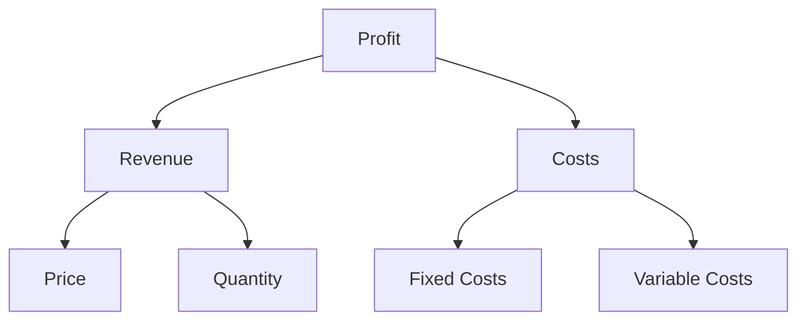
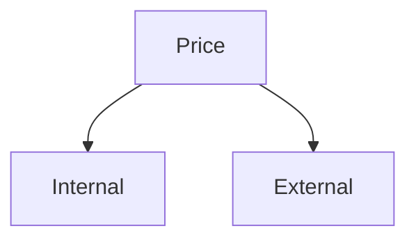
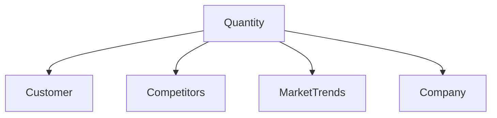
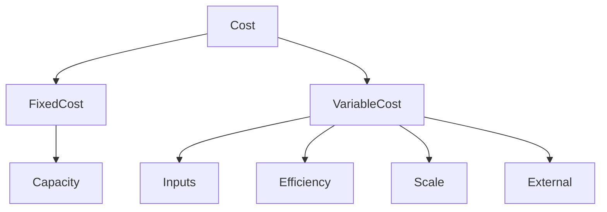

## 02 - Profit Framework

#### Profit = (Revenue - Cost)

### Diagram 1: Top-Level Overview (1 Level Deep)
Layer 1: What is happening?

### Diagram 2: Expanded View (2nd Level)
Layer 2: Why it is happening?

---
#### Deep dive into Revenue drivers

## 1️⃣ Revenue -> Price

---

## 2️⃣ Revenue -> Quantity

---
#### Deep dive into Cost drivers

## 1️⃣ Cost -> Fixed

---

