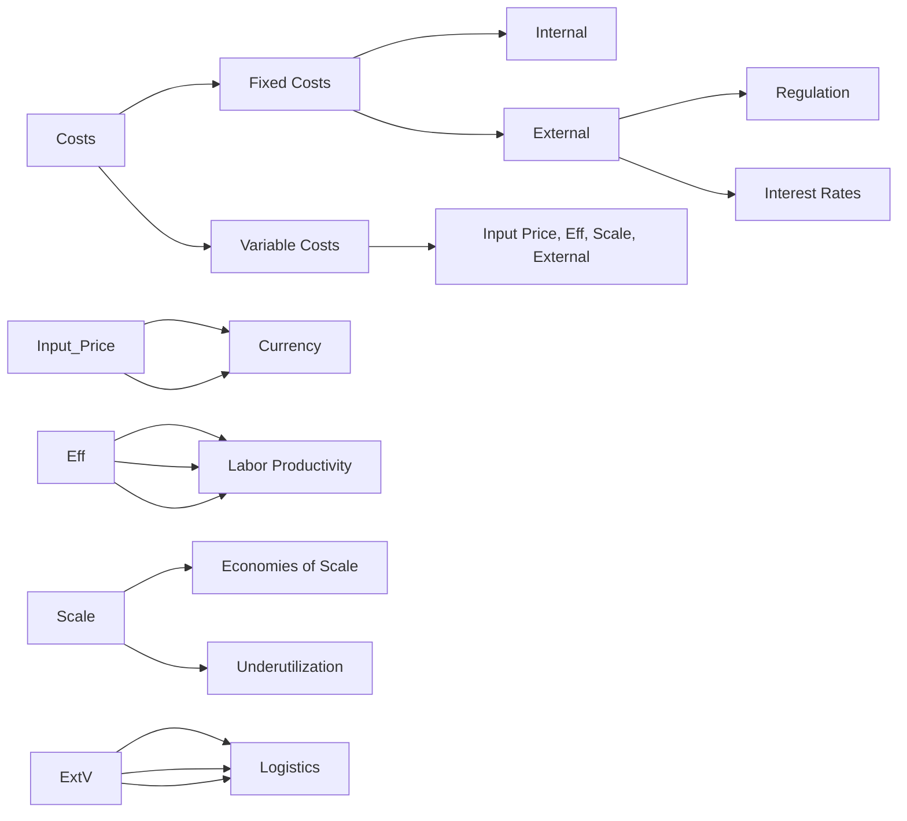

# Cost Reduction Framework

This framework provides a structured, MECE-based approach to **reducing costs**.  
It is split into two main steps:

1. **Step 1: Cost Assessment** – Identify where the issues are  
2. **Step 2: Cost Diagnosis** – Break down costs into actionable drivers

---

## Step 1: Cost Assessment

Before acting, assess cost irregularities and benchmark against peers and trends.

### Key Questions
- Are costs increasing over time?  
- How do we compare vs competitors?  
- Which cost components are abnormal?  

### Methods
- **Trend Analysis** → Track costs over time  
- **Benchmarking** → Compare with competitors / industry  
- **Variance Analysis** → Planned vs actual costs  
- **Segmentation** → Break costs by product, region, customer  

**Note:** This step is **textual and analytical**, no diagram needed. It identifies **where to focus** before diagnosing cost drivers.

---

## Step 2: Cost Diagnosis

Break down costs into **MECE components** to identify actionable drivers.

### Diagram: Cost Diagnosis

# Cost Reduction Framework

This framework provides a structured, MECE-based approach to **reducing costs**.  
It is split into two main steps:

1. **Step 1: Cost Assessment** – Identify where the issues are  
2. **Step 2: Cost Diagnosis** – Break down costs into actionable drivers

---

## Step 1: Cost Assessment

Before acting, assess cost irregularities and benchmark against peers and trends.

### Key Questions
- Are costs increasing over time?  
- How do we compare vs competitors?  
- Which cost components are abnormal?  

### Methods
- **Trend Analysis** → Track costs over time  
- **Benchmarking** → Compare with competitors / industry  
- **Variance Analysis** → Planned vs actual costs  
- **Segmentation** → Break costs by product, region, customer  

**Note:** This step is **textual and analytical**, no diagram needed. It identifies **where to focus** before diagnosing cost drivers.

---

## Step 2: Cost Diagnosis

Break down costs into **MECE components** to identify actionable drivers.

### Diagram: Cost Diagnosis (Horizontal)

### How to Use This Step
 - Identify which branch drives the cost increase
 - Drill down to root causes (leaf nodes)
 - Prioritize high-impact and controllable areas

### MECE Check ✅
 - Fixed vs Variable → no overlap
 - Internal vs External → clearly separated
 - Covers all major cost drivers

### Output
 - Clear identification of:
 - Cost drivers
 - Root causes
 - Priority areas for action

### Summary
#### Cost Reduction Framework Flow:
1. Assessment → Where are the cost issues?
2. Diagnosis → Why are costs high?
3. (Next step, optionally: Action Planning → How to reduce costs)
