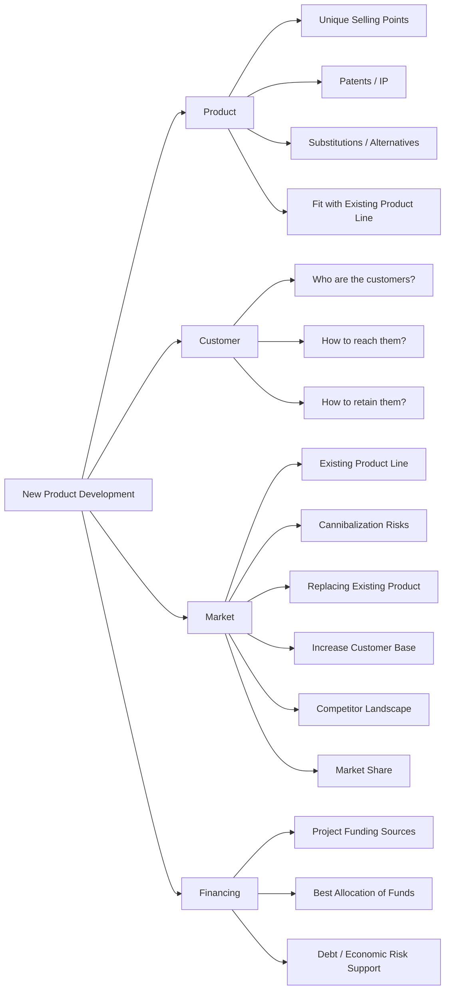

# New Product Development Framework

This framework helps structure the analysis and planning for **launching a new product**, covering **Product, Customer, Market, and Financing** considerations.

---

## Framework Overview

The framework is split into four pillars:

1. **Product** – Evaluate uniqueness and fit  
2. **Customer** – Identify target users and retention strategy  
3. **Market** – Assess impact on portfolio and competition  
4. **Financing** – Plan funding and financial risk management  

---

### How to Use
 - Evaluate product uniqueness and strategic fit
 - Identify target customers and outreach strategy
 - Analyze market implications, including cannibalization and competition
 - Plan financing, ensuring resources are allocated effectively and risks mitigated

---
## Horizontal Diagram: New Product Development

### Summary

The New Product Development Framework ensures:

- Clear evaluation of product uniqueness and fit
- Understanding of customer acquisition and retention
- Assessment of market impact and competition
- Financial planning for funding and risk management
