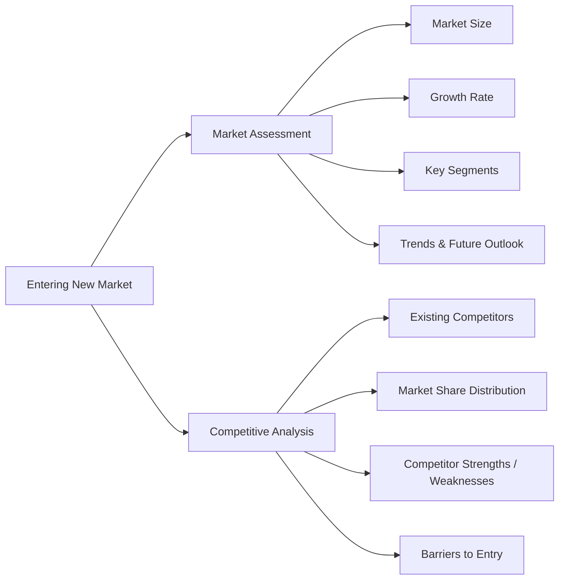
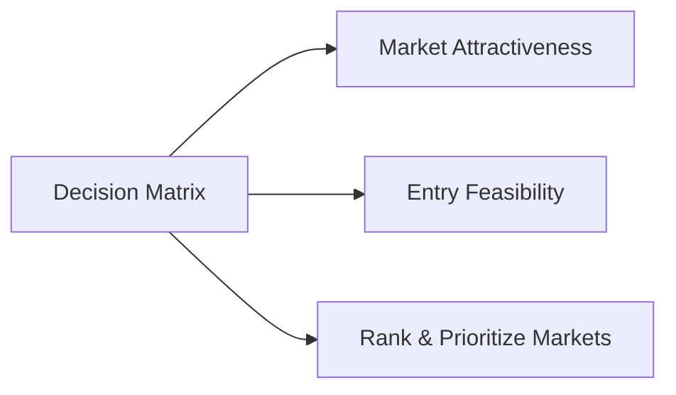

# Entering New Market Framework

This framework guides companies through **strategic market entry**, ensuring a structured and MECE approach.

---

Entering New Market

### How to Use
1. Assess each potential market using Market Assessment and Competitive Analysis
2. Score and prioritize using a Decision Matrix
3. Design entry strategy tailored to the chosen market(s)
4. Iterate based on real-time intelligence and feedback

---

## Step 3: Decision Matrix

Prioritize markets based on **attractiveness** and **feasibility**.

#### Summary

This Entering New Market Framework ensures a structured approach to:

 - Evaluate market attractiveness
 - Understand competitive dynamics
 - Prioritize markets through a decision matrix
Execute entry strategy effectively and efficiently
