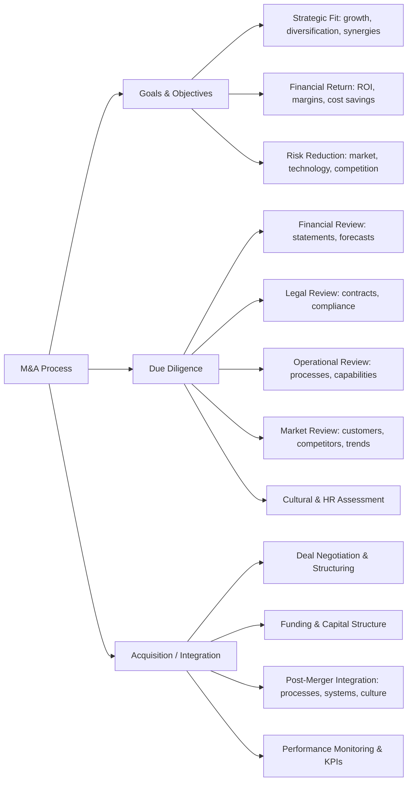

# M&A Framework

This framework guides companies through **mergers and acquisitions (M&A)**, ensuring a structured and MECE approach from strategic goals to execution.

---

## Framework Overview

The M&A process is broken down into **three main stages**:

1. **Goals & Objectives** – Define strategic rationale for the deal  
2. **Due Diligence** – Assess risks, valuation, and operational fit  
3. **Acquisition / Integration** – Execute the transaction and integrate successfully  

**Decision Gates:**  
- **Gate 1:** Post-Goals & Objectives – approve whether to proceed with diligence  
- **Gate 2:** Post-Due Diligence – approve whether to execute the acquisition  

---

### How to Use
  - Define strategic and financial objectives for the M&A
  - Conduct comprehensive due diligence to identify risks and opportunities
  - Apply decision gates to approve progression
  - Negotiate the deal structure and secure funding
  - Execute integration plan with clear ownership and KPIs
  - Continuously monitor performance and synergies

---

## Horizontal Diagram: M&A Framework

### Summary

The M&A Framework ensures:

  - Clear strategic objectives
  - Comprehensive risk and opportunity assessment
  - Structured deal execution and integration
  - Ongoing performance monitoring to realize synergies
