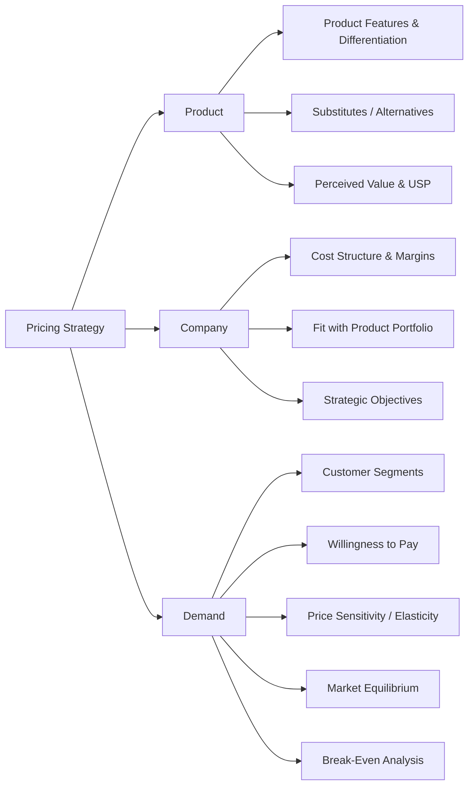
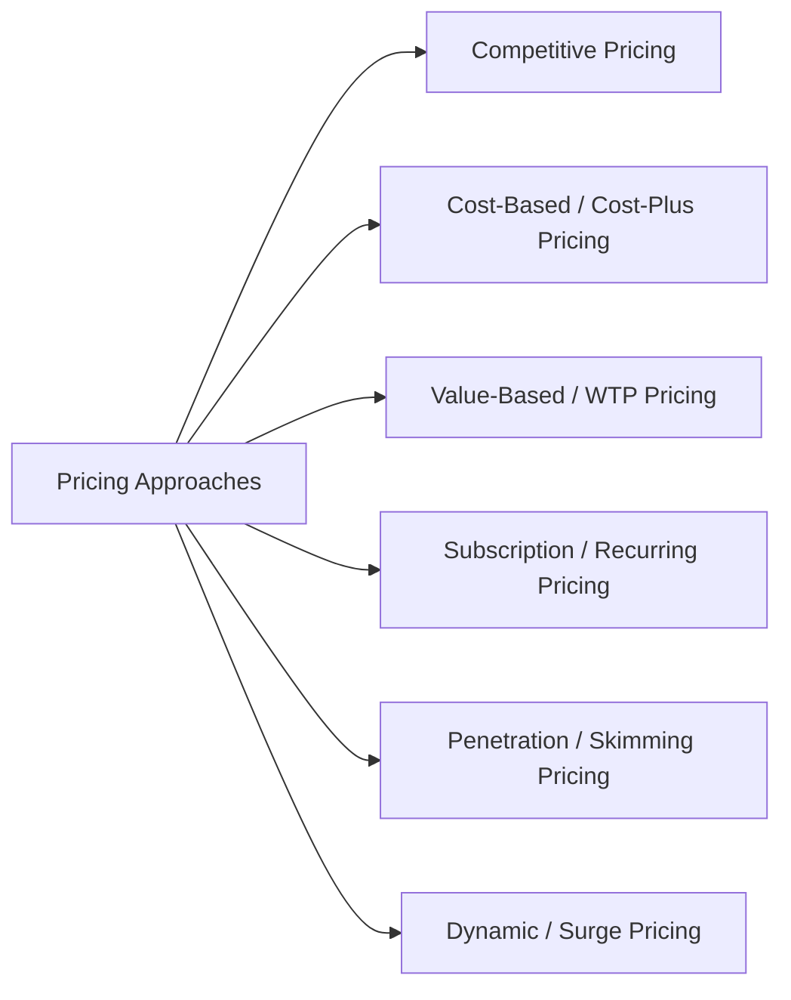

# Pricing Strategy Framework

This framework structures **pricing decisions** using a **MECE approach** across **Product, Company, Demand, and Pricing Approaches**.

---
### How to Use
  - Analyze Product: differentiation and substitutes
  - Assess Company: costs, margins, break-even, strategic alignment
  - Evaluate Demand: segments, WTP, elasticity, market equilibrium
  - Choose Pricing Approaches (see separate diagram)
  - Test, monitor, and optimize pricing iteratively

## MECE Pillars Overview

1. **Product** – Features, uniqueness, and perceived value  
2. **Company** – Costs, margins, and strategic objectives  
3. **Demand** – Customer willingness to pay, market equilibrium, break-even  
4. **Pricing Approaches** – Tactical methods like competitive, subscription, dynamic, etc.

---

## Horizontal Diagram: Pricing MECE Pillars

---

## Horizontal Diagram: Pricing Approaches

---
### Summary

The Pricing Strategy Framework ensures:

  - MECE coverage of all pricing determinants
  - Clear evaluation of product, company, and demand factors
  - Flexible adoption of multiple pricing approaches
  - Consulting-style structure ready for presentations and strategy discussions
