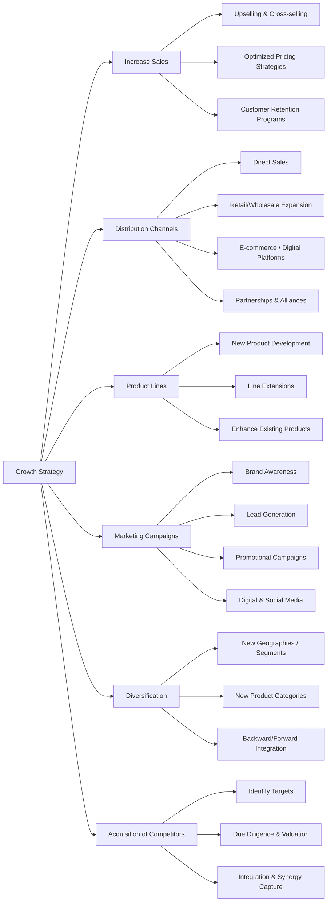

# Growth Strategy Framework

This framework guides companies to identify and implement growth opportunities through **multiple strategic levers**, using a **MECE structure**.

---

## MECE Pillars for Growth

Growth opportunities can be broken down into **six main pillars**:

1. **Increase Sales** – Boost revenue from existing products and customers  
2. **Distribution Channels** – Expand reach through new or optimized channels  
3. **Product Lines** – Expand or enhance offerings  
4. **Marketing Campaigns** – Drive awareness, leads, and conversions  
5. **Diversification** – Enter new markets or develop new products  
6. **Acquisition of Competitors** – Grow market share through M&A  

---

## Horizontal Diagram: Growth Strategy

---
### How to Use
  - Evaluate current growth performance across sales, channels, and products
  - Identify gaps and opportunities in marketing, diversification, and M&A
  - Prioritize levers based on strategic alignment and ROI potential
  - Develop an implementation roadmap with KPIs for each pillar
  - Monitor results and iterate

---
### Summary

The Growth Strategy Framework ensures:

  - A structured, MECE approach to explore all growth opportunities
  - Integration of organic growth (sales, product, marketing) and inorganic growth (acquisitions)
  - Clear implementation roadmap and monitoring
  - Consulting-ready visualization and documentation
