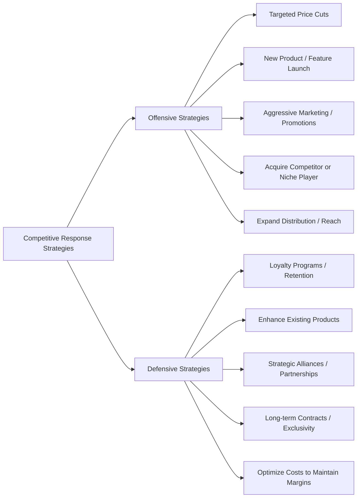

# Competitive Response Framework

This framework helps companies **respond strategically to competitor moves**, ensuring structured decision-making using a MECE and consulting-style approach.

---

## Framework Overview

Competitive response consists of three main steps:

1. **Why / Analyze Impact** – Understand why a competitor action matters and assess its potential impact  
2. **How / Strategic Response** – Define **offensive and defensive strategies**  
3. **Evaluate & Prioritize** – Assess ROI, risk, and alignment to company objectives  

---

## Step 1: Why / Analyze Impact

Key considerations:

- **Market Share Impact:** Will this move capture your customers or market?  
- **Revenue & Margin Impact:** How will this affect your financials?  
- **Customer Perception:** Brand, loyalty, and reputation implications  
- **Strategic Alignment:** Does it affect long-term goals?  
- **Urgency:** How quickly must a response be executed?  

> This step ensures that the **response is purposeful and not reactive**.  

---

## Step 2: How / Strategic Response

---

## Step 3: Evaluate & Prioritize

**Key criteria to prioritize competitive responses:**

  - Impact: Potential revenue, market share, or strategic gain
  - Feasibility: Internal capabilities, resources, and time required
  - Risk: Execution risk, competitive escalation, or regulatory issues
  - Alignment: Strategic fit with company vision and long-term goals
  - Timing/Urgency: Must respond immediately or can plan phased execution

**Tools to aid prioritization:**

    - Decision Matrix: Impact vs Feasibility
    - Scenario Analysis: Model competitor reactions and contingencies
    - Financial Modeling: Project ROI and break-even for each strategy

### Summary

The Competitive Response Framework ensures:

  - Structured approach to assess competitor actions (Why)
  - MECE categorization of strategic responses (How)
  - Rigorous evaluation and prioritization of options (Evaluate & Prioritize)
  - Consulting-style roadmap for decision-making and implementation
