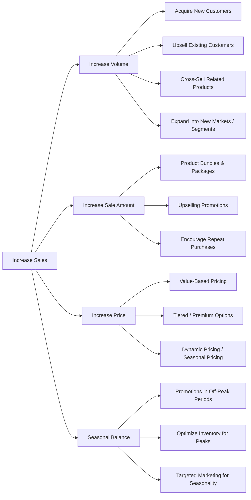

# Increasing Sales Framework

This framework helps companies **boost revenue systematically** by analyzing **key sales levers** and identifying actionable strategies.

---

## MECE Pillars for Increasing Sales

Revenue can be increased through four main levers:

1. **Increase Volume** – Sell more units to existing or new customers  
2. **Increase Sale Amount** – Encourage higher transaction value per sale  
3. **Increase Price** – Optimize pricing strategy to maximize margin  
4. **Seasonal Balance** – Smooth sales across peak and off-peak periods  

---

### How to Use
1. Analyze current sales metrics to identify gaps in volume, transaction value, or pricing
2. Select levers with highest impact potential
3. Implement actions for each lever (marketing, product, pricing, sales)
4. Monitor KPIs: Units sold, transaction value, revenue, margin, seasonal trends
5. Iterate & Optimize based on performance
   
---

## Horizontal Diagram: Increasing Sales

---
### Summary

The Increasing Sales Framework provides a structured approach to:

1. MECE identification of key revenue levers
2. Actionable sub-levers for each category
3. Monitoring and iterative optimization
4. Consulting-ready visualization for strategy discussions
