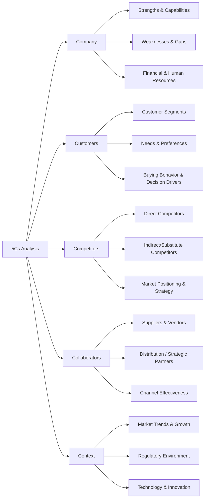
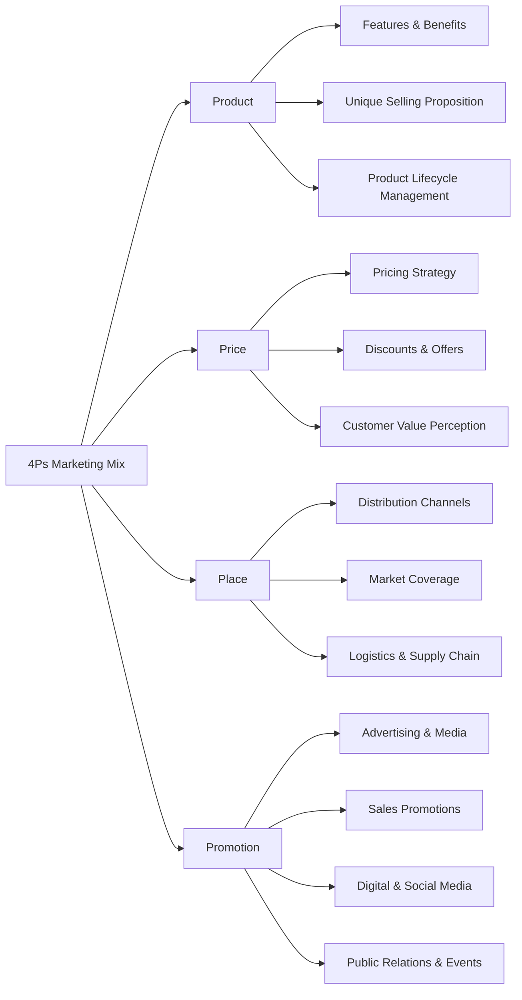

# 5Cs and 4Ps Marketing Framework

This framework combines **external and internal analysis (5Cs)** with **marketing execution (4Ps)**, providing a structured approach for strategy development.

---
### How to Use the Framework
1. Perform 5Cs Analysis
  - Map internal strengths, customer needs, competitive landscape, partners, and market context
2. Derive Marketing Mix
  - Translate insights into Product, Price, Place, and Promotion strategies
3. Evaluate & Iterate
  - Test assumptions, assess alignment with objectives, monitor results
4. Integrate with KPIs
  - Product: adoption rate, return
  - Price: margin, sales growth
  - Place: coverage, channel efficiency
  - Promotion: engagement, conversion

---
## Step 1: 5Cs Analysis

The **5Cs** help you assess the environment and context before defining marketing strategies.

---

### 4Ps

---

### Summary

The 5Cs + 4Ps framework provides:

  - Structured analysis of environment and company capabilities
  - MECE approach to marketing execution
  - Consulting-ready diagrams and actionable insights
  - Foundation for strategic marketing decisions
