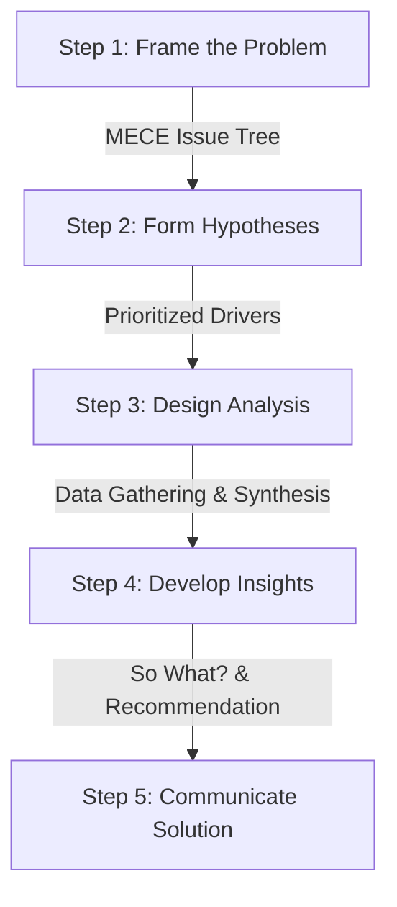

## Hypothesis-Driven Consulting Methodology

This section outlines the hypothesis-driven consulting methodology, including diagnostic issue trees, a hypothesis-driven approach, and a 5-step playbook. It is designed to help consultants structure complex business problems and arrive at data-driven solutions efficiently.

### 📋 The 5-Step Consulting Playbook

This playbook outlines a standard, repeatable process to move from an ambiguous challenge to a data-backed recommendation.

#### STEP 1: Frame the Problem (Define the Scope)

* **Objective:** To arrive at a single, shared, and actionable definition of the problem.
* **Key Techniques:**
    * **SCR (Situation-Complication-Resolution):** Contextualize the baseline and the catalyst for change (e.g., in [RecSys example](./communication/scr.md)).
    * **SMART Check:** Is the problem statement Specific, Measurable, Actionable, Relevant, and Time-bound?

#### STEP 2: Formulate Hypotheses (Deconstruct Logic)

* **Objective:** To decompose the overarching problem into a logically complete set of component drivers.
* **Key Techniques:**
    * **MECE Issue Trees (Logic Trees):** Deconstruct the problem space into distinct, non-overlapping categories (Mutually Exclusive, Collectively Exhaustive) (e.g., [MECE Messaging](./communication/mece_messaging.md)).
    * **Hypothesis-Driven Approach:** State leading theories *before* data gathering to focus analysis.

#### STEP 3: Design Analysis (Collect & Prioritize)

* **Objective:** To determine exactly what data is needed to prove or disprove the hypotheses, while maximizing resource efficiency.
* **Key Techniques:**
    * **The 80/20 Rule (Pareto Principle):** Focus on the 20% of hypotheses generating 80% of the impact.
    * **Work Plan & Ghost Decks:** Create an analysis matrix mapping hypotheses to data sources and expected chart outputs.

#### STEP 4: Develop Insights (Synthesize the 'So What?')

* **Objective:** To transform raw data and analysis into unique, data-backed insights leading to strategic recommendations.
* **Key Techniques:**
    * **'So What?' Synthesis:** Continuously challenge findings to derive deep strategic meaning.

#### STEP 5: Communicate the Solution (The Recommendation)

* **Objective:** To present a logically sound, compelling, and actionable recommendation focusing on the resolution and implementation plan.
* **Key Techniques:**
    * **The Pyramid Principle (Top-Down Communication):** Lead with the governing recommendation, followed by organized, MECE evidence (e.g., [Pyramid Principle](./communication/pyramid_principle.md)).
    * **STAR Method:** Structure success stories or case studies demonstrating quantifiable impact (e.g., [STAR Method](./communication/star.md)).

---

### How to Apply this Methodology

For Strategy Operators and Product Managers navigating ambiguity, this methodology provides structural guardrails:

> Before starting a project: Force stakeholders to agree on a single SMART Problem Statement using SCR.

> When launching a feature: Deconstruct the product requirements (PRD) into a MECE Issue Tree to identify every critical logical risk or dependency.

> When reviewing project metrics: Challenge every data point with the 'So What?' test to drive toward actual strategic decisions, rather than passive reporting.

---
\*For strategy operators and product managers navigating ambiguity, this methodology provides essential structural guardrails for data-backed decision-making.\*
