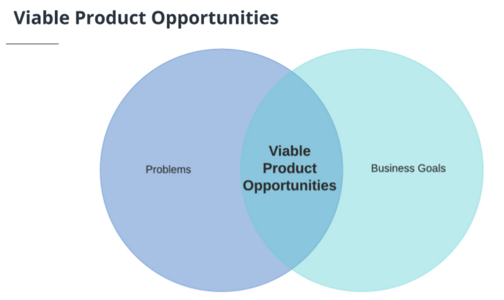
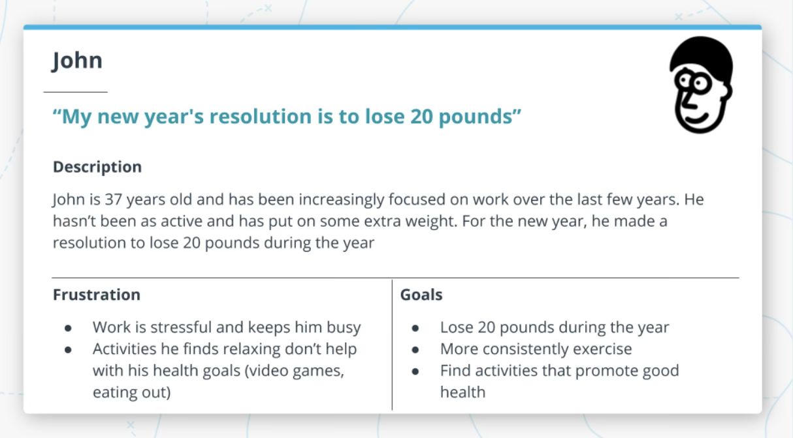
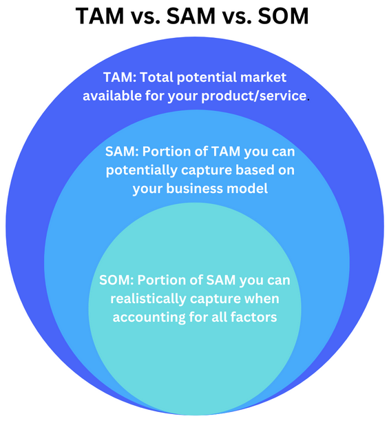
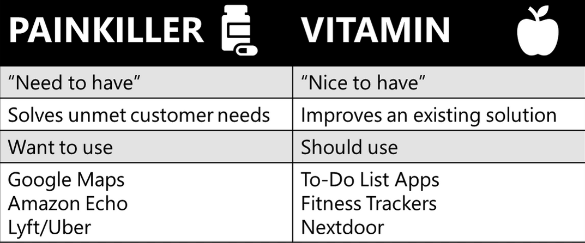

## Identifying Requirements
 - PRD
 - Identifying requirements is an active process than just gathering.
     - It happens through variety of channels
     - User interviews stakeholders
     - Input from users/customers
     - Customers usually don't tell what they need (Push deeper for motivations and needs that might not be apparent)
  
#### Product Requirements Document
 - Its is the source of truth that answers the question WHAT is the team building and WHY
 - Its a continously evolving (living document)
 - Outline goals
 - Describe requirements

### Roadmap
 - High level overview of the direction of the product over time.
 - What is required to meet business objectives
 - Powerful artifact they set expectations across team in terms of team's priorities
 - Drive alignment across teams and help in making tradeoffs

### How to identify opportunities
 - Find right problem to solve is critical for success of your product
 - Not all problems need to solved as time is limited and all problems don't have same impact
 So how to decide?
  - Market research, User research, Product data, Support data, efficiency gains

    - 

### Understanding the market
- Understanding the market is critical to building successful products. 
- Some markets are better than others. And some products do a better job than others. 
- You’ll want to make sure that your product satisfies the needs of the market.

### Product Market fit
1. What makes a good market?
  - Market size
  - Growth rate
  - Acquiring customers

2. Product market fit
  - User are getting value
  - Product sells itself
  - High demand

### Industry trends
- Team is interested in building product to track fitness and improve health over time.
- What benefits does fitness provide?
    - Combats diseases
    - Improves mood, boost energy, sleep better 
- What products are in market?
    - Apps, smartwatches 
- How much people spend
    - $150 / month
    - Category / amount
    - Supplements, Clothing, Gym, Meal plan, Trainers

### Identify target customer
 - Why find target user?
   - It is important to understand whom we are building the product for.
   - Problem will be best solved in different ways for different types of user.
   - It creates focus and solving the needs of that specific target user
   - To identify target user, you need to talk to your users and do market research

- Eg: Building a grade school calculator vs Scientific calculator

#### Profile
Eg: John
- Description
- Frustration
- Goals
   - 

### Market Sizing
- TAM: Average revenue per user x # of potential users
- ROI: Measure efficiency of investment.
    - Helps to focus where your team's time will have biggest impact

- There are several approaches to calculating TAM:
  
**Top Down**
 - You start with a high level view of the economy, and then narrow that down based on factors like demographics. For example, you usually will start will everyone in the world and narrow down that audience to people who are interested in your product.
**Bottoms Up**
 - This involves using known data points that you have (data from early customers and sales) that you could extrapolate to represent a larger market opportunity. For example, if you are already selling a product in one region and were considering selling it globally.
**Value Theory**
 - Generally used for new product categories where you don’t have much information to base estimates on. This involves conducting market research to understand how much people would pay for your product and how many potential customers you have.

   - 

### Hypothesis

- Before building your product to want to make sure your assumptions are correct.
  - Hypothesis should be based on 
  - Customer needs
  - Differentitation
  - Value (How much will customer pay)

- Hypothesis can tested in many ways such as:
  - User interviews
  - Focus groups
  - Surveys
  - Design sprint

    - 

### Payback period
 - Payback period: Amount of time it takes to regain initial cost of building the product
 - payback period = Cost / (Impact/time)

### Templates
1. PRD
2. Roadmap
3. Market Sizing Techniques
4. Profile
5. Competitive Analysis
6. Product Market Fit
