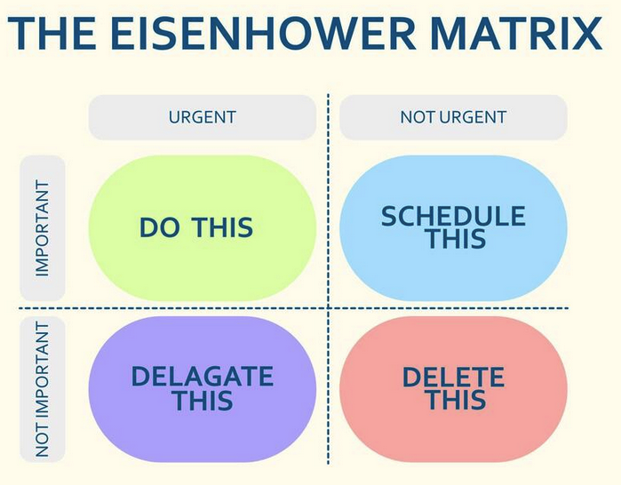

## 1. **Eisenhower matrix**

📌 What is it?

A prioritization framework that helps you decide what to:

Do now
Schedule
Delegate
Delete

⏰ When to Use It

Use Eisenhower Matrix when:

You feel overloaded with tasks
Everything feels “urgent”
You need to improve time management
You are planning your daily/weekly work
You want to separate noise vs impact

📍 Where to Use It

Common use cases:

📅 Daily planning (PMs, founders)
🧑‍💼 Personal task management
🗂️ Sprint task triage
📊 Backlog grooming
🤝 Stakeholder request filtering

# Eisenhower Matrix – PM Tasks Example

| Quadrant | Meaning | Example Tasks | Action |
|----------|--------|---------------|--------|
| 🟥 Urgent + Important | Do now | Production bug fix, system outage, critical customer issue | Do immediately |
| 🟧 Not Urgent + Important | Plan | Roadmap planning, user research, strategy work | Schedule |
| 🟨 Urgent + Not Important | Interruptions | Slack pings, minor stakeholder requests, routine approvals | Delegate |
| ⛔ Not Urgent + Not Important | Waste | Unnecessary meetings, outdated reports, low-value tasks | Eliminate |

 - Important vs urgency
     - Highly important, Very urgent - Eg: Crisis. Do it immediately.
     - Highly important, Not very urgent - Eg: Roadmap. Plan and schedule
     - Not important, Very urgent - Eg: Respond to emails. Delegate
     - Not important, Not urgent - Eg: Ignore drop it.
    
🧠 **Real PM Example (Food Delivery App)**
 **Quadrant	Example**
  
  🟥 Do now	App crash during checkout
  
  🟧 Plan	Improve delivery ETA accuracy
  
  🟨 Delegate	Update FAQ page content
  
  ⛔ Delete	Internal status report no one reads

   
