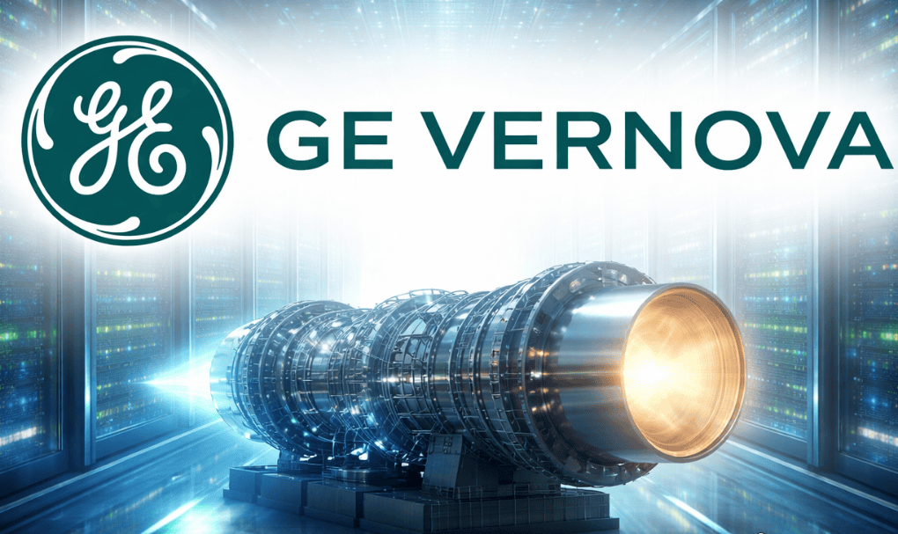

# PRD Review: GE Vernova (Energy Platform Ecosystem)

## Overview

GE Vernova is an energy infrastructure and industrial technology platform spanning power generation, grid systems, and renewable energy solutions. It combines physical assets (turbines, grids, plants) with digital software and analytics to improve reliability, efficiency, and decarbonization.

In PRD terms, GE Vernova is a **mission-critical industrial platform operating at global energy scale**.

| Area | Review |
|---|---|
| Product | Energy generation, grid management, and renewable optimization platform |
| Core use case | Produce, distribute, and optimize energy reliably at scale |
| Platform model | Industrial + software + AI-driven infrastructure platform |
| Primary value | Energy reliability, efficiency, and decarbonization |
| Review type | PRD review with infrastructure + AI transformation lens |

---

## What is the Platform?

GE Vernova is a platform because it:

- Orchestrates **multi-asset energy systems (plants, turbines, grids)**
- Connects **hardware + software + analytics + operators**
- Enables **integration across utilities, renewables, and industrial users**
- Provides a **standardized control and observability layer**
- Acts as an **energy operating system for physical infrastructure**

**Analogy:**
> GE Vernova is the “AWS of energy infrastructure”—but for physical systems.

---

## Core Job-To-Be-Done (JBTD)

Energy operators use GE Vernova to:

- Keep power systems running **without interruption**
- Balance **energy supply and demand in real time**
- Reduce **downtime and maintenance cost**
- Integrate **renewables into unstable grids**
- Predict and prevent **system failures**
- Optimize **fuel usage and emissions**
- Ensure **regulatory and safety compliance**

> JTBD: “Help me operate complex energy systems safely, efficiently, and reliably with minimal downtime and risk.”

---

## Customer Segments

| Segment | Needs | Product Implication |
|---|---|---|
| Utilities | Grid stability, demand balancing | Grid optimization + forecasting |
| Power plant operators | Uptime and reliability | Monitoring + control systems |
| Renewable operators | Variability management | AI forecasting + integration tools |
| Transmission operators | Fault detection | Real-time grid intelligence |
| Industrial energy users | Cost optimization | Energy efficiency systems |
| Governments | Compliance and reporting | Audit + emissions dashboards |
| Maintenance teams | Predictive maintenance | Sensor + AI failure prediction |

---

## AI Opportunity (High Impact Layer)

AI transforms GE Vernova from reactive infrastructure to predictive and autonomous energy systems.

### 1. Predictive Maintenance AI
- Detect turbine/grid failures before breakdown
- Reduce downtime and maintenance cost

### 2. Grid Optimization AI
- Real-time load balancing across regions
- Dynamic routing of energy flow

### 3. Digital Twins of Energy Systems
- Simulate entire power plants and grids
- Run scenario planning (“what happens if demand spikes?”)

### 4. Renewable Forecasting AI
- Predict solar/wind variability
- Stabilize renewable-heavy grids

### 5. Autonomous Energy Operations
- Self-healing grid behavior
- Automated fault isolation and rerouting

### 6. Carbon Optimization AI
- Optimize generation mix for lowest emissions
- Real-time sustainability tradeoffs

---

## Future Evolution

### Stage 1: Digitized Infrastructure (Today)
- Monitoring dashboards
- SCADA systems
- Basic predictive maintenance

### Stage 2: Intelligent Energy Platform
- AI forecasting and anomaly detection
- Cross-asset optimization
- Digital twin adoption across plants and grids
- Semi-automated decision support

### Stage 3: Autonomous Energy OS (Future)
- Self-healing grids
- Autonomous load balancing
- AI-driven generation scheduling
- Continuous optimization of energy + emissions + cost

> End state: “A self-managing global energy system”

---

## Market Analysis

The energy industry is undergoing structural transformation:

- **Energy transition** → fossil → hybrid → renewable-heavy systems
- **Grid decentralization** → distributed energy sources (DERs)
- **Electrification** → EVs + industrial load increase
- **Climate regulation** → strict emissions constraints
- **AI adoption in industry** → predictive + autonomous operations
- **Aging infrastructure** → urgent modernization need

GE Vernova sits at the intersection of:
> Energy transition × industrial modernization × AI infrastructure

---

## Competition

| Category | Competitors |
|---|---|
| Industrial energy systems | Siemens Energy, Schneider Electric |
| Grid intelligence | ABB, Hitachi Energy |
| Renewable platforms | Vestas, Enel |
| Cloud energy analytics | AWS, Google Cloud Energy |
| Energy AI startups | Grid optimization SaaS players |

Competitive pressure is shifting from:
- Hardware-only competition → software + AI-driven differentiation

---

## Current Pain Points

| Pain Point | Impact | Risk |
|---|---|---|
| Grid instability | Blackouts, overloads | High |
| Aging infrastructure | Frequent failures | High |
| Fragmented systems | Poor visibility | High |
| High maintenance cost | Operational inefficiency | High |
| Slow modernization | Delayed innovation | Medium |
| Data silos | Weak AI effectiveness | High |

---

## Risks and Trade-offs

| Risk | Tradeoff | Implication |
|---|---|---|
| More AI automation | Reduced human override control | Efficiency ↑, safety governance complexity ↑ |
| Higher system integration | Increased complexity | Better visibility, harder deployments |
| Digital twin expansion | High compute cost | Better simulation accuracy, infrastructure cost ↑ |
| Cloud dependency | Latency + sovereignty concerns | Scalability ↑, regulatory friction ↑ |
| Autonomous grid control | Model failure risk | Efficiency ↑, catastrophic risk potential ↑ |
| More sensors/data | Operational overhead | Better insights, higher maintenance burden |

---

## Key Metrics

| Metric | Why It Matters |
|---|---|
| Grid uptime % | Core reliability KPI |
| Asset downtime | Operational efficiency |
| Failure prediction accuracy | AI effectiveness |
| Energy efficiency ratio | Cost + performance |
| Maintenance cost reduction | ROI |
| Emissions reduction | Sustainability KPI |
| Incident response time | Safety and reliability |

---

## Future Product Risks

- Over-reliance on AI in safety-critical systems
- Cybersecurity vulnerabilities in connected grids
- Regulatory constraints on autonomous energy systems
- Legacy system integration complexity
- Model drift in forecasting systems
- High cost of real-time digital twin computation

---

## Strategic Trade-offs

### 1. Stability vs Innovation
- Energy systems require extreme reliability
- Innovation must not disrupt uptime

### 2. Automation vs Control
- More autonomy improves efficiency
- But reduces operator intervention safety margins

### 3. Centralization vs Decentralization
- Central control improves coordination
- Distributed energy requires flexible architecture

### 4. Cost vs Intelligence
- More sensors + AI improves accuracy
- But significantly increases infrastructure cost

---

## Final Assessment

| Area | Score |
|---|---|
| Strategic importance | 10/10 |
| AI transformation potential | 10/10 |
| Platform depth | 9.5/10 |
| Operational complexity | 9/10 |
| UX clarity (operator systems) | 7.5/10 |
| Overall assessment | 9.3/10 |

---

## Key Takeaway

GE Vernova is evolving from an industrial energy provider into a **AI-driven autonomous energy platform**, where the long-term vision is not just monitoring energy systems—but **operating them intelligently, predictively, and autonomously at global scale**.
