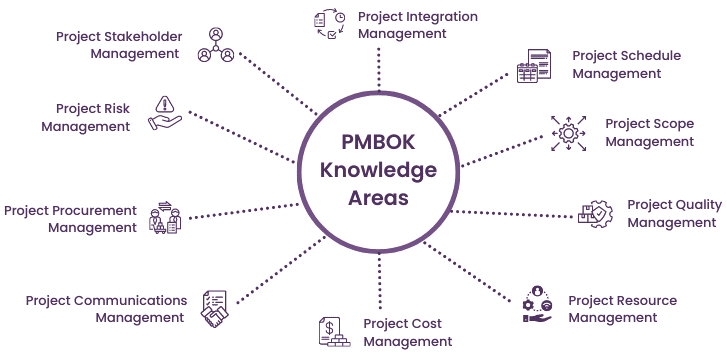

# Chapters

This folder holds chapter‑wise notes aligned with classic PMBOK‑style structure (you can adapt to PMBOK 7/8 later).
Click on any chapter to open its folder:

## Chapter list

| Chapter number | Chapter name                    | Folder link |
|----------------|----------------------------------|-------------|
| ch01           | Introduction                    | [ch01_introduction](./ch01_introduction/01_Intro.md) |
| ch02           | Integration                     | [ch02_integration](./ch02_integration/02_IntegrationMgmt.md) |
| ch03           | Scope                           | [ch03_scope](./ch03_scope/03_ScopeMgmt.md) |
| ch04           | Schedule                        | [ch04_schedule](./ch04_schedule/04_ScheduleMgt.md) |
| ch05           | Cost                            | [ch05_cost](./ch05_cost/05_CostMgmt.md) |
| ch06           | Quality                         | [ch06_quality](./ch06_quality/ch06_QualityMgmt.md) |
| ch07           | Resources                       | [ch07_resources](./ch07_resources/ch07_ResourceMgmt.md) |
| ch08           | Communications                  | [ch08_communications](./ch09_communications/ch08_CommunicationsMgmt.md) |
| ch09           | Risk                            | [ch09_risk](./ch09_risk/ch09_RiskMgmt.md) |
| ch10           | Stakeholders                    | [ch10_stakeholders](./ch10_stakeholders/ch10_StakeholderMgmt.md) |
| ch11           | Procurement                     | [ch11_procurement](./ch11_procurement/) |
