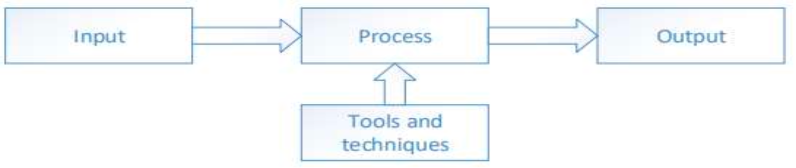
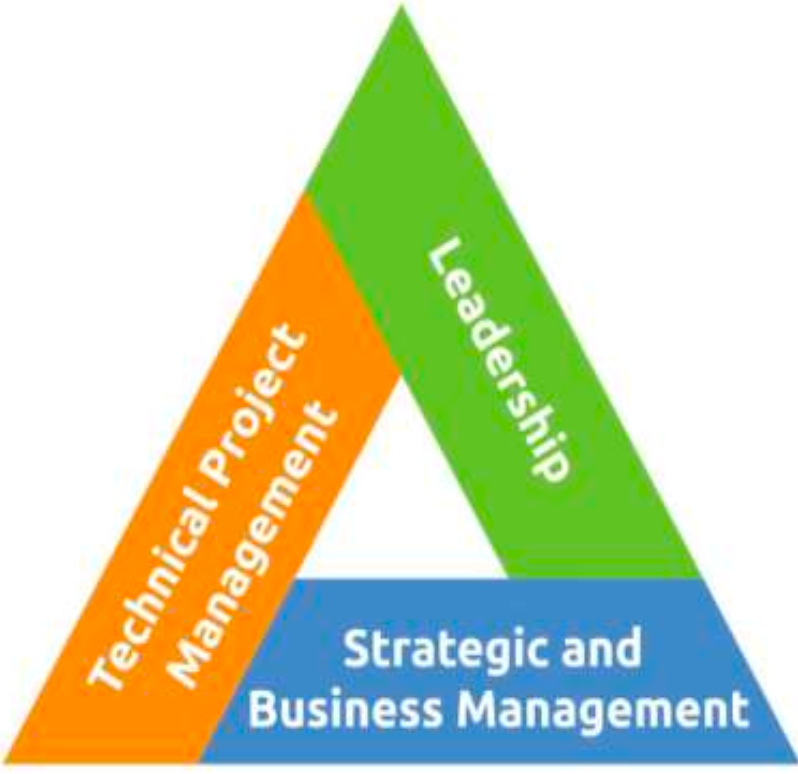

## INTRO

### What is a Project?
- A temporary endeavor that produces a unique product, service, or result
- Temporary in nature and has a definite beginning and ending
- Projects drive change in organizations
- Projects enable business value creation

Examples: 
1. Developing a new pharmaceutical compound for market
2. Developing a new business process or improving an existing one
3. Installing a new computer hardware system

### Factors to initate a Project
Factors to initiate a project
- Meet regulatory, legal, or social requirements
- Satisfy stakeholder requests or needs;
- Implement or change business or technological strategies
- Create, improve, or fix products, processes, or services

### What is Project Management?
- Project management is the application of knowledge, skills, tools, and techniques to satisfy project requirements
  - Preparing a business case to justify the investment
  - Estimating resources and times
  - Developing and implementing a management plan for the project
  - Leading and motivating the project delivery team
  - Managing the risks, issues, and changes on the project
  - Monitoring progress against plan
  - Closing the project in a controlled fashion when appropriate
 
### What is Program Management?
- Group of related projects managed in a coordinated way to obtain
benefits and control not available from managing them individually
 - Must be some value add in managing them together as a
program
 - A project may or may not be part of a program, but a program will always have projects
 - Focuses on the project interdependencies and helps to
determine the optimal approach for managing them

### What is Portfolio Management?
- A portfolio is a collection of projects, programs, subsidiary
portfolios, and operations managed as a group to achieve strategic
objectives.
 - Collections of Projects, Programs, subsidiarity Portfolios
 - Achieve strategic (long term) objectives

### Operations Management
 - Deals with the ongoing production of goods and/or Services.
 - Considers the acquisition, development, and utilization of
resources that firms need to deliver the goods and services.

### What is Project life cycle?
- Is the series of phases that a project passes through from its start to its completion. It provides the basic framework for managing the project
Project life cycles can be predictive or adaptive. 
Within a project life cycle, there are generally one or more phases that are associated with the development of the product, service, or result. These are called a development life cycle.

### Types
 - Predictive - project scope, time, and cost are determined in the early phases of the life cycle. Waterfall
 - Iterative life cycle - the project scope is generally determined early in the project life cycle, but time and cost estimates are routinely modified.
 - Incremental life cycle, the deliverable is produced through a series of iterations that successively add functionality within a predetermined time frame.
 - Adaptive life cycles are agile, iterative, or incremental. The detailed scope is defined and approved before the start of an iteration. Eg: Agile
 - Hybrid life cycle is a combination of a predictive and an adaptive life cycle. Fixed requirements follow a predictive development life cycle, and those elements that are still evolving follow an adaptive development life cycle

## What is Project phase?
 - A project phase is a collection of logically related project activities that culminates in the completion of one or more deliverables
Eg: Feasibility Study, Custoemr Requirements, Prototype, Design, Testing, Lessons learned

 - Project phases are established on various factors (management needs, project nature, organization characterisitcs, decision points (go/no go)
Why so many phases? Better insight to managing the project
 - Provides an opportunity to assess the project performance and take necessary corrective or preventive actions in subsequent phases.

## Stakeholders
 - Individuals, group, or organization that may affect, be affected, or
perceive to be affected by the project.
Key Stakeholders
 -  Project Manager - manages the project
 - Customer - uses the project deliverable
 - Project team - the collection of individuals completing the project
work
 - Project Sponsor – Provides resources and support
 - Functional Manager - Departmental Manager, i.e Manager of
Engineering, Vice President of Marketing, Director of IT. Generally
controls resources

## Project Management Processes
 - Project life cycle is managed by executing a series of project management activities known as project
management processes.

## Project Managment Processes by Knowledge Areas and Groups

## Complete Mapping Table

| Knowledge Area | Initiating | Planning | Executing | Monitoring & Controlling | Closing |
|----------------|------------|----------|-----------|--------------------------|---------|
| **Integration** | 4.1 Develop Project Charter | 4.2 Develop Project Mgmt Plan | 4.3 Direct & Manage Project Work 4.4 Manage Project Knowledge | 4.5 Monitor & Control Project Work 4.6 Perform Integrated Change Control | 4.7 Close Project/Phase |
| **Scope** | | 5.1 Plan Scope Mgmt 5.2 Collect Requirements 5.3 Define Scope 5.4 Create WBS | | 5.5 Validate Scope 5.6 Control Scope | |
| **Schedule** | | 6.1 Plan Schedule Mgmt 6.2 Define Activities 6.3 Sequence Activities 6.4 Estimate Activity Durations 6.5 Develop Schedule | | 6.6 Control Schedule | |
| **Cost** | | 7.1 Plan Cost Mgmt 7.2 Estimate Costs 7.3 Determine Budget | | 7.4 Control Costs | |
| **Quality** | | 8.1 Plan Quality Mgmt | 8.2 Manage Quality | 8.3 Control Quality | |
| **Resources** | | 9.1 Plan Resource Mgmt 9.2 Estimate Activity Resources | 9.3 Acquire Resources 9.4 Develop Team 9.5 Manage Team | 9.6 Control Resources | |
| **Communications** | | 10.1 Plan Communications Mgmt | 10.2 Manage Communications | 10.3 Monitor Communications | |
| **Risk** | | 11.1 Plan Risk Mgmt 11.2 Identify Risks 11.3 Perform Qualitative Risk Analysis 11.4 Perform Quantitative Risk Analysis 11.5 Plan Risk Responses | 11.6 Implement Risk Responses | 11.7 Monitor Risks | |
| **Procurement** | | 12.1 Plan Procurement Mgmt | 12.2 Conduct Procurements | 12.3 Control Procurements | |
| **Stakeholder** | 13.1 Identify Stakeholders | 13.2 Plan Stakeholder Engagement | 13.3 Manage Stakeholder Engagement | 13.4 Monitor Stakeholder Engagement | |

## Quick Rememberance technique
 - **Knowledge areas**
 - Integration of Scope, Schedule, Cost & Quality with Resource
 - Communicating the Risk of Procurement to the Stakeholders

  - No of process under each Knowledge area 766 43 63 73 4

**Quick remembrance**
  - Initiating-Do It
  - Planning(9) +DCDCD+SEDEDE+IPPP
  - Execution-Manage(5)+DAD Is Correct
  - Monitoring and Control-Monitor(4)+ Control(6)+V+P
  - Close

## Project Management Data and Information
- Throughout the life cycle of a project, a significant amount of data is collected, analyzed, and transformed. 
 - Project data are collected as a result of various processes and are shared within the project team. The collected data are analyzed in context, aggregated, and transformed to become project information during various processes.
 - Information is communicated verbally or stored and distributed in various formats as reports.

**Work performance data** The raw observations and measurements. 
  **Examples** include number of change requests, number of defects
**Work performance Information** Collectd from various controlling processes. 
  **Example** status of deliverables
**Work performance reports** The physical or electronic representation of work performance information
 **Example** Dashboards, status reports

## Business Documents
 - Business Case -> Documented economic feasibility study used to establish the validity of the benefits of a selected component
lacking sufficient definition and that is used as a basis for the authorization of further project management activities. Accountable by Project Sponsor

## Project Charter
 - project charter is defined as a document issued by the project sponsor that formally authorizes the existence of a project and
Provides the project manager with the authority to apply organizational resources to project activities.

## EEFs
 - Enterprise environmental factors (EEFs) refer to conditions, not under the control of the project team, that influence,
constrain, or direct the project.

**EEFs Internal to the organization**
 - Organizational culture, structure, and governance
 - Geographic distribution of facilities and resources.
 - Infrastructure.
 - Information technology software.
 - Resource availability.
 - Employee capability.

**EEFs External to the organization**
 - Marketplace conditions
 - Legal restrictions
 - Government or industry standards
 - Financial considerations.
 - Physical environmental elements

**Organizational process assets (OPAs)** 
 - are the plans, processes, policies, procedures, and knowledge bases specific to and used by the performing organization.
   - Eg: Lessons learned from previous projects

## PMI Triangle
**Technical Project Management****
  - Skills to apply project management knowledge.
**Leadership**
  - Ability to guide, motivate, and direct a team.
**Strategic Business Management**
  - High-Level of the organization
  - Working knowledge of business functions such as IT or Finance
  - Product and Industry expertise
  - Seek knowledge from functional managers

## Leadership styles
  - Laissez-Faire: The project manager is hands-off, allowing the team to make their own decisions.
  - Transactional: PM more focused on the goals of the project and how to reward team members
  - Servant Leader: PM focuses on removing obstacles from the team and giving the team what is needed in order to complete the work.
  - This is mostly used in agile projects.
  - Transformational: PM tries to empower the project team, and motivates and inspires them.
  - Charismatic: PM has high energy and is very enthusiastic, influence people around them.
  - Interactional: This is a combination of different leadership styles such as charismatic and transactional.
