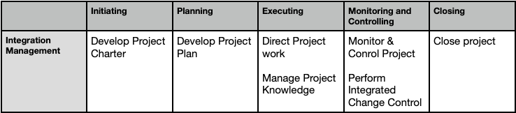

## Project Integration Mgmt
 - Project Integration Mgmt includes all the processes and activities to
identify, define, combine, unify, and coordinate the various processes and
project management activities within the Prj Mgmt Process groups

## 1. Develop Project Charter
The process of developing a document that formally authorizes the existence of
a project and provides the project manager with the authority to apply
organizational resources to project activities

**Key Benefit**: Direct link between project and organization commitment

**ITTO (Input, Tools & Techniques, Output)**
| Inputs                                      | Tools & Techniques                     | Outputs               |
|--------------------------------------------|----------------------------------------|-----------------------|
| 1. Business case                           | 1. Expert judgement                    | 1. Project Charter    |
| 2. Agreements                              | 2. Data gathering                      | 2. Assumption Log     |
| 3. EEFs (Enterprise Environmental Factors) | 3. Team skills                         |                       |
| 4. OPAs (Organizational Process Assets)    | 4. Meetings                            |                       |

**Output:**
- project charter ensures a common understanding by the stakeholders of the key
deliverables, milestones, and the roles and responsibilities of everyone involved in
the project.

Assumption Log: Records all assumptions and constraints thought the project life cycle.

**Template:** [Project Charter](../../templates/ProjectCharter_template.xlsx)

 

## 2. Develop Project Plan
Develop Project Plan: process of defining, preparing, and coordinating all plan components and consolidating them into an integrated project management plan

**Key Benefit**- The production of a comprehensive document that defines the
basis of all project work and how the work will be performed

**ITTO (Input, Tools & Techniques, Output)**
| Inputs                                      | Tools & Techniques                     | Outputs               |
|--------------------------------------------|----------------------------------------|-----------------------|
| 1. Project Charter                         | 1. Expert judgement                    | 1. Project Plan       |
| 2. Output from other process               | 2. Data gathering                      |      |
| 3. EEFs (Enterprise Environmental Factors) | 3. Team skills                         |                       |
| 4. OPAs (Organizational Process Assets)    | 4. Meetings                            |                       |

project management plan defines how the project is executed, monitored
and controlled, and closed.
The plan should be baselined in reference to scope, time and cost.
It integrates and consolidates all of the subsidiary plans and
baselines, and other information necessary to manage the project

Template: [Project Mgmt Plan](../../templates/ProjectPlan_template.docx)

## 3. Direct Project work
process of Leading and Performing the work defined in the project
management plan and implementing approved changes to achieve the project’s
objectives

**Key Benefit**- Provides overall management of the project work and deliverables,
thus improving the probability of project success

**ITTO (Input, Tools & Techniques, Output)**
| Inputs                                      | Tools & Techniques                     | Outputs               |
|--------------------------------------------|----------------------------------------|------------------------|
| 1. Project Plan                            | 1. Expert judgement                    | 1. Deliverables        |
| 2. Project docs                            | 2. PMIs                                | 2. WPD                 |
| 3. EEFs (Enterprise Environmental Factors) | 3. Meetings                            | 3. Change Request      |
| 4. OPAs (Organizational Process Assets)    |                                        | 4. Project Plan updates |
| 5. Approved Change Requests                |                                        |                         |

**Output:**
 - deliverable is any unique and verifiable product, result, or capability to
perform a service that is required to be produced to complete a process,
phase, or project
 - Work performance data are the raw observations and measurements
 - Issue log is a project document where all the issues. help the project manager effectively track and manage issues, ensuring that they are investigated and resolved

## 4. Manage Project knowledge

Manage Project Knowledge: process of using existing knowledge and creating new knowledge to achieve the project’s objectives and contribute to organizational learning

**Key Benefit**- prior organizational knowledge is leveraged to produce or improve
the project outcomes.

**ITTO (Input, Tools & Techniques, Output)**
| Inputs                                      | Tools & Techniques                     | Outputs               |
|--------------------------------------------|----------------------------------------|------------------------|
| 1. Project Plan                            | 1. Expert judgement                    | 1. Lessons Learned     |
| 2. Project docs                            | 2. Knowledge Mgmt                      | 2. Project Plan updates|
| 3. EEFs (Enterprise Environmental Factors) | 3. Team Skills                         | 3. Updates OPAs      |
| 4. OPAs (Organizational Process Assets)    |                                        |                         |
| 5. Deliverables                            |                                        |                         |

A lessons learned register may record challenges, problems, realized risks
and opportunities

**Template**: [Lessons Learned Register](../../templates/LessonsLearnedRegister_template.xlsx)

At end of project or phase, the information is transferred to an organizational process asset called a lessons learned repository

Explicit Knowledge( expressive knowledge)-This can be readily codified using words, pictures, and numbers
Tacit Knowledge(garnered from personal experience)-This is personal and difficult to express, such as beliefs, insights, experience, and “know-how”

## 5. Monitor & Control Project

Monitor and Control Project work: process of tracking, reviewing, and reporting the overall progress to meet the performance objectives defined in project plan.

**Key Benefit**- Allows stakeholders to understand the current state of the project

**ITTO (Input, Tools & Techniques, Output)**
| Inputs                                      | Tools & Techniques                     | Outputs               |
|--------------------------------------------|----------------------------------------|------------------------|
| 1. Project Plan                            | 1. Expert judgement                    | 1. WPR     |
| 2. Project docs                            | 2. Data Analysis (Cost Benefit, RCA, Trend, Variance | 2. Change Requests|
| 3. EEFs (Enterprise Environmental Factors) | 3. Decision Making                    | 3. Updates Project plan      |
| 4. OPAs (Organizational Process Assets)    | 4. Meetings                                       |                         |
| 5. WPI                            |                                        |                         |

Monitoring includes collecting, measuring, and assessing measurements and
trends to effect process improvements

Control includes determining corrective or preventive actions or replanning
and following up on action plans

**Output:**
Work performance reports are the physical or electronic representation of
work performance information intended to generate decisions, actions, or awareness
comparing planned results to actual results, change requests
may be issued to expand, adjust, or reduce project scope, product scope, or
quality requirements and schedule or cost baselines

## 6. Integrated Change Control
**Integrated Change Control**: process of reviewing all change requests; approving changes and managing changes to deliverables, project documents, and the project management plan; and communicating the decisions

**Key Benefit** Allows for documented changes within the project to be considered
in an integrated manner while addressing overall project risk

**ITTO (Input, Tools & Techniques, Output)**
| Inputs                                      | Tools & Techniques                     | Outputs               |
|--------------------------------------------|----------------------------------------|------------------------|
| 1. Project Plan                            | 1. Expert judgement                    | 1. Approved CR     |
| 2. Project docs                            | 2. Data Analysis (Cost Benefit, RCA, Trend, Variance | |
| 3. Change Requests                         | 3. Decision Making                    | 2. Updates Project plan      |
| 4. WPR                                     | 4. Meetings                                       |                         |

**Change Process:**
1. Stakeholder identifies a CR
2. Written request is submitted to PM
3. Assess the change
4. Submitted to CCB
5. Approval or denial by CCB

Approved change requests will be implemented through the Direct and Manage
Project Work process.
Deferred or rejected change requests are communicated to the person or
group requesting the change

## 6. Close project or phase

process of finalizing all activities for the project, phase, or contract

**Key Benefit**- planned work is completed, and organizational team resources are released to pursue new endeavors

**ITTO (Input, Tools & Techniques, Output)**
| Inputs                                      | Tools & Techniques                     | Outputs               |
|--------------------------------------------|----------------------------------------|------------------------|
| 1. Project Charter                            | 1. Expert judgement                    | 1. Final Product or service|
| 2. Project docs                               | 2. Data Analysis (Cost Benefit, RCA, Trend, Variance | 2. Final Reports | 
| 3. Accepted Deliverables                      | 3. Decision Making                    | 3. Updates Project plan      |
| 4. Business docs, OPAs                        | 4. Meetings                                       |                         |

Activities necessary for the administrative closure of the project or phase. Meet the exit criteria. 
Confirming formal acceptance of deliverables by customer
Measuring stakeholder satsifaction
Completion of contractual agreements

The Close Project or Phase process also establishes the procedures to investigate and document the reasons for actions taken if a project is terminated before completion

**Output:**
A product, service, or result, once delivered by the project, may be handed
over to a different group or organization that will operate, maintain, and
support it throughout its life cycle.

**Final report:** Summary level description of the project or phase. Scope objectives, cost objectives, quality objectives, final product or service achieved the benefits.
