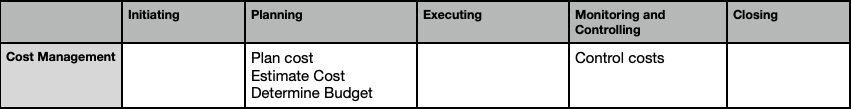

## Project Cost Mgmt
 - processes involved in planning, estimating, budgeting, financing, funding, managing, and controlling costs so that the project can be
completed within the approved budget 

### 1. Plan Cost Management
  - process of defining how the project costs will be estimated, budgeted, managed, monitored, and controlled
  
  - Key benefit: Provides guidance and direction on how the project costs will be managed throughout the project

**ITTO (Input, Tools & Techniques, Output)**
| Inputs                                      | Tools & Techniques                     | Outputs               |
|--------------------------------------------|----------------------------------------|-----------------------|
| 1. Project Charter                         | 1. Expert judgement                   | 1. Cost management plan |
| 2. Project Plan                            | 2. Data Analysis                      |                       |
| 3. EEFs (Enterprise Environmental Factors) | 3. Alternative analysis               |                       |
| 4. OPAs (Organizational Process Assets)    | 4. Meetings                            |                       |

#### Key Inputs:
**Risk Management Plan**
  - The risk management plan provides processes and controls that will impact cost estimation and management

#### Key Output: 
1. Cost Management Plan - The cost management plan is a component of the project management plan and describes how the project costs will be planned, structured, and
controlled.

### 2. Estimate Cost 
  - The process of developing an approximation of the cost of resources needed to complete project work.
  - Key benefit: Determines the monetary resources required for the project.

**ITTO (Input, Tools & Techniques, Output)**
| Inputs                                      | Tools & Techniques                     | Outputs               |
|--------------------------------------------|----------------------------------------|-----------------------|
| 1. Project docs (Lesson lernt, risk register)                   | 1. Expert judgement                   | 1. Cost management plan |
| 2. Project Plan                            | 2. Analogous estimating, parametric estimating, Bottom up estimating etc | 2. Basis of estimates |

- Cost estimates include the identification and consideration of costing alternatives make versus buy, buy versus lease, and the sharing of resources in 
order to achieve optimal costs for the project.

#### Key Outputs:
  1. Cost estimates include quantitative assessments of the probable costs required to complete project work, as well as contingency amounts to
account for identified risks, and management reserve to cover unplanned work.
  2. Basis of Estimates
    - Documentation of the basis of the estimate (i.e., how it was developed)
    - Documentation of all assumptions made,
    - Documentation of any known constraints,
    - Indication of the range of possible estimates

### 3. Determine Budget 
  - process of aggregating the estimated costs of individual activities or work packages to establish an authorized cost baseline

  - Key benefit: Determines the cost baseline against which project performance can be monitored & controlled.

**ITTO (Input, Tools & Techniques, Output)**
| Inputs                                      | Tools & Techniques                     | Outputs               |
|--------------------------------------------|----------------------------------------|-----------------------|
| 1. Project docs (Lesson lernt, risk register)                   | 1. Cost aggregation                   | 1. Cost baseline |
| 2. Project Plan                            | 2. Historical info, funding limit etc | 2. Project funding requirements |

#### Tools & Techniques
  1. Cost Aggregation
     - Cost estimates are aggregated by work packages in accordance with the WBS

  2. Funding Limit Reconciliation
     - The expenditure of funds should be reconciled with any funding limits on the commitment of funds for the project.

  3. Historical Information review
     - Reviewing historical information can assist in developing parametric estimates or analogous estimates.

  4. Financing
    - Financing entails acquiring funding for projects.

#### Key Outputs:
  1. Cost Baseline - approved version of the time-phased project budget that includes contingency reserves, excluding any management reserves, which can only
be changed through formal change control procedures

  2. Project funding requirements - Total funding requirements and periodic funding requirements (e.g., quarterly, annually) are derived from the cost baseline)

### 4. Control Cost 
  - The process of monitoring the status of the project to update the project costs and managing changes to the cost baseline.
  
  - Key benefit: Cost baseline is maintained throughout the project

**ITTO (Input, Tools & Techniques, Output)**
| Inputs                                      | Tools & Techniques                     | Outputs               |
|--------------------------------------------|----------------------------------------|-----------------------|
| 1. Project docs (Lesson lernt, risk register)                   | 1. Earned value analysis                   | 1. WPI |
| 2. Project Plan                            | 2. variance analysis, trend analysis etc | 2. Cost forecasts |

Project cost control includes:
 Influencing the factors that create changes to the authorized cost baseline.
 Ensuring that all change requests are acted on in a timely manner.
 Managing the actual changes when and as they occur

#### Tools & Techniques
  1. Earned Value Analysis - Earned value analysis compares the performance measurement baseline to
the actual schedule and cost performance
   Eg: PV=Planned % of work complete X BAC

  - Earned value (EV) is a measure of work performed expressed in terms of the 
budget authorized for that work. It is the budget associated with the authorized work that has been completed
  Eg: EV=Actual % of work complete X BAC

  - Actual cost (AC) is the realized cost incurred for the work performed on an activity during a specific time period

  2. Variance Analysis 
    - Schedule variance (SV):Measure of schedule performance expressed as the difference between the earned value and the planned value.
     - SV = EV – PV
    - Cost variance (CV): Amount of budget deficit or surplus at a given point in time, expressed as the difference between earned value and the actual cost 
     - CV = EV – AC
    - Schedule performance index (SPI): Measure of schedule efficiency expressed as the ratio of earned value to planned value
     - SPI = EV/PV
    - Cost performance index (CPI):Measure of the cost efficiency of budgeted resources, expressed as a ratio of earned value to actual cost
     - CPI = EV/AC

- Budget at Completion (BAC): Measure that is often used in earned value management to track the actual cost of a project against its forecasted budget

- Estimate at Completion (EAC):The current expectation of total cost at the end of a project

- Variance at Completion(VAC): A projection of the amount of budget deficit or surplus, expressed as the difference between the budget at completion and
the estimate at completion 

- The Estimate To Complete (usually abbreviated ETC) is the remaining cost you expect to pay in order to complete a project
       - ETC = EAC – AC

  3. Trend Analysis
    - Trend analysis examines project performance over time to determine if performance is improving or deteriorating that may lead to develop a forecast
for the estimate at completion (EAC) 

  4. Reserve Analysis
    - During cost control, reserve analysis is used to monitor the status of contingency and management reserves for the project to determine if these
reserves are still needed or if additional reserves need to be requested.

#### Key Outputs
  1. Work Performance Information - Work performance information includes information on how the project work is performing compared to the cost baseline

  2. Cost Forecasts - Either a calculated EAC value or a bottom-up EAC value is documented and communicated to stakeholders
