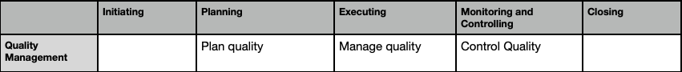

## Project Quality Mgmt
 - processes for incorporating the organization’s Quality policy(regarding planning, managing, and controlling project) and 
Product Quality requirements in order to meet stakeholders’ objectives

### 1. Plan Quality Management
  - process of 
    a) Identifying Quality requirements and/or standards for the project and its deliverables &
    b) Documenting how the project will demonstrate compliance with Quality requirements and/or standards
  
  - Key benefit: Provides guidance and direction on how the Quality will be managed and verified throughout the project

**ITTO (Input, Tools & Techniques, Output)**
| Inputs                                      | Tools & Techniques                     | Outputs               |
|--------------------------------------------|----------------------------------------|-----------------------|
| 1. Project Charter                         | 1. Expert judgement                   | 1. Quality management plan |
| 2. Project Plan                            | 2. Benchmarking                      | 2. Quality metrics |
| 3. EEFs (Enterprise Environmental Factors) | 3. Cost Benefit Analysis               |                       |
| 4. OPAs (Organizational Process Assets)    | 4. Test and inspection planning                            |                       |

#### Tools & Techniques:
**Matrix diagrams**
  - Helps to find the strength of relationships among different factors between the rows and columns that form the matrix
  - Test & inspection Planning - Determine how to test or inspect the product, deliverable, or service to meet the stakeholders’ needs and expectations

#### Key Output:  
1. Quality Management Plan 
  - The component of the project management plan that describes how applicable policies, procedures, and guidelines will be
implemented to achieve the quality objectives

2. Quality Metrics 
  - A quality metric specifically describes a project or product attribute and how the Control Quality process will verify compliance to it.
  - Ex. percentage of tasks completed on time, number of defects , total downtime per month etc.,

### 1. Manage Cost Management
  - process of 
    a) Process of translating the Quality management plan into executable Quality activities that incorporate the organization’s quality
policies into the project 
  
  - Key benefit: Increases the probability of meeting the Quality objectives as well as identifying ineffective processes and causes of poor quality

**ITTO (Input, Tools & Techniques, Output)**
| Inputs                                      | Tools & Techniques                     | Outputs               |
|--------------------------------------------|----------------------------------------|-----------------------|
| 1. Project Charter                         | 1. Doc analysis. process analysis, RCA     | 1. Quality reports |
| 2. Project docs, Quality metrics, risk report           | 2. Cause effect diagrams, Hisograms, Design for X etc                    | 2. Test Eval docs |

Manage Quality is sometimes called Quality Assurance, i.e.using project processes
effectively
Manage Quality includes all the quality assurance activities, and is also concerned with
the product design aspects and process improvements.

Manage Quality is the process of auditing the quality requirements and the results from
quality control measurements to ensure that appropriate quality standards and operational
definitions are used. The quality audits test and/or confirm that the system is functioning

#### Tools & Techniques:
**1. Checklist** - Quality checklists should incorporate the acceptance criteria included in the scope baseline

**2. Doc Analysis** - analysis of different documents can point to and focus on processes that may be out of control

**3. Root Cause Analysis** - An analytical technique used to determine the basic underlying reason that causes a variance, defect, or risk

**4. Cause effect** - Diagram breaks down the causes of the problem statement identified into discrete branches, helping to identify the main
or root cause of the problem 

**5. Audits** - An audit is a structured, independent process used to determine if project activities comply with organizational and project policies, processes, and
procedures

**6. Design for X** - Design for X (DfX) is a set of technical guidelines that may be applied during the design of a product for the optimization of a specific aspect of the design
[X refers to-Engineering, manufacturing, assembly etc.,]

#### Key Outputs: 
  1. Quality Reports - issues escalated by the team
  2. Test and Evaluation Docs - Test and evaluation documents created based organization’s templates

2. Quality Control
  - process of monitoring and recording results of executing the quality management activities in order to assess performance and ensure the
project outputs are complete, correct, and meet customer expectations

  - Key benefit: Verifying that project deliverables and work meet the requirements specified by key stakeholders for final acceptance.

**ITTO (Input, Tools & Techniques, Output)**
| Inputs                                      | Tools & Techniques                     | Outputs               |
|--------------------------------------------|----------------------------------------|-----------------------|
| 1. Project docs                         | 1. Chek sheets, stats sampling     | 1. Quality control measurements |
| 2. WPD, Change Requests, Deliverables           | 2. Inspection, control charts etc                    | 2. Verfiied deliverables |

#### **Tools & Techniques**
1. Control Charts - Used to determine whether or not a process is stable or has predictable performance
Rule of Seven: On a control chart, when seven consecutive data points fall on the same side of the mean, either above
or below, the process is said to be out of control and in need of adjustment

#### Key Outputs: 
1. Quality Control Measurements
  - Quality control measurements are the documented results of Control Quality
activities

2. Verified Deliverables
  - goal of the Control Quality process is to determine the correctness of deliverables
  
  - results of performing the Control Quality process are verified deliverables that become an input to the Validate Scope process for
formalized acceptance
