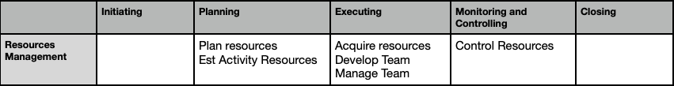

## Project Resource Mgmt
 - processes to identify, acquire, and manage the resources needed for the successful completion of the project
 - These processes help ensure that the right resources will be available to the project manager and project team at the right time
and place
 - Management of both Physical (equipment, materials, facilities, and infrastructure) & Team resources(Human Resources)
 - 

### 1. Plan Resource
  - process of 
     process of defining how to Estimate, Acquire, Manage & Use team and physical resources
    
  - Key benefit: Establishes the approach and level of management effort needed for managing project resources based on the type and complexity of the project

**ITTO (Input, Tools & Techniques, Output)**
| Inputs                                      | Tools & Techniques                     | Outputs               |
|--------------------------------------------|----------------------------------------|-----------------------|
| 1. Project Charter                         | 1. Data Representation - Hierarchy chart                   | 1. Resource management plan |
| 2. Project Plan                            | 2. Responsibility assignment matrix                      | 2. Team charter |
| 3. Project doc                             |                 |                       |
| 4. Risk register, Stakeholder register     |                             |                       |

#### Tools & Techniques:
**Hierarchical chart**
  - hierarchical list of team and physical resources related by category and resource type
 **Responsibility Assignment Matrix**
  - RACI

#### Key Output:  
1. Resource Management Plan  
  - component of Project Management plan that provides guidance on how project resources should be categorized allocated, managed, & released.
  - Identification of resources, Acquiring resources, Roles Responsibilities, Org chart

2. Team Chrter
  - Acceptable behavior within the project.
  - Team values, Communication guidelines, DM criteria, conflict resolution process, meeting guidlines

### 2. Estimate Activity Resource
  - process of estimating Team resources and the type and quantities of materials, equipment, and supplies necessary to perform project work
    
  - Key benefit: identifies the type, quantity, and characteristics of resources required to complete the project

**ITTO (Input, Tools & Techniques, Output)**
| Inputs                                      | Tools & Techniques                     | Outputs               |
|--------------------------------------------|----------------------------------------|-----------------------|
| 1. Project Plan                         | 1. Expert judgement, Bottom up estimating                   | 1. Resource requirements plan |
| 2. Project doc (Acivity list, Assumption log)                            | 2. Responsibility assignment matrix                      | 2. Basis of estimates, RBS |

#### Tools & Techniques:
**Bottom Up Estimating**
  - Break down the activities in more detail until you can assign the resources. You can then aggregate them back up to the full activity
    
 **Analogous Estimating**
  -  Analogous estimation relies on historical information to assign the current duration to the activities. It is based on a limited amount of information

 #### Key Output:  
1. Resource requirements  
  - types and quantities of resources required for each work package or activity in a work package and can be aggregated to determine the estimated resources for each work package, each WBS branch, and the project as a whole

2. Basis of Estimate
 - Develop estimate, assumption of estimate, constraints, range of estimates

3. RBS
 - Category: Labor, material, supplies

### 3. Acquire Resource
  - process of obtaining team members, facilities, equipment, materials,supplies and other resources necessary to complete project work
    
  - Key benefit: Outlines and guides the selection of resources & assigns them to their respective activities

**ITTO (Input, Tools & Techniques, Output)**
| Inputs                                      | Tools & Techniques                     | Outputs               |
|--------------------------------------------|----------------------------------------|-----------------------|
| 1. Project Plan                         | 1. Team skills Negotiation                   | 1. Resource Physical |
| 2. Project doc (Acivity list, Assumption log)                            | 2. Responsibility assignment matrix                      | 2. Resource calendars |

- Internal resources are acquired (assigned) from functional or resource managers. External resources are acquired through the procurement processes.

**Factors to be considered while acquiring Resources** 
 - project manager/project team should effectively negotiate and influence others who are in a position to provide the required team and physical
resources
 - team resources are not available due to constraints-Assign alternative resources

#### Tools & Techniques:
**Decision Making**
  - Multi criteria decision analysis

**Interpersonal & Team Skills**
  - Functional managers, external organizations

 #### Key Output:  
1. Resource Assignments
  - records the material, equipment, supplies, locations, and other physical resources that will be used during the project
2. Project Team Assignments
  - Documentation of team assignments records the team members and their roles and responsibilities for the project
3. Resource Calendars
  - Identifies the working days, shifts, start and end of normal business hours,
weekends, and public holidays when each specific resource is available.

### 4. Develop Team
  - process of improving competencies, team member interaction, & overall team environment to enhance project performance
    
  - Key benefit: Results in improved teamwork, enhanced interpersonal skills and competencies, motivated employees, reduced attrition, and improved overall
project performance

**ITTO (Input, Tools & Techniques, Output)**
| Inputs                                      | Tools & Techniques                     | Outputs               |
|--------------------------------------------|----------------------------------------|-----------------------|
| 1. Project Plan                         | 1. Colocation                   | 1. Team performance assessments |
| 2. Project doc (Acivity list, Assumption log) | 2. Virtual teams, motivation, team buliding, Assessment, rewards |  |

**Team Development Model** 
 1. Tuckman Ladder
     - Forming, Storming, Norming, Performing, Adjourning

#### Key Output:  
 1. Team performance assessments
   - Efforts such as training, team building, and colocation are implemented, the project management team makes formal or
     informal assessments of the project team’s effectiveness

### 4. Managing Team 
  - process of tracking team member performance, providing feedback, resolving issues, and managing team changes to optimize project performance
    
  - Key benefit: Influences team behavior, manages conflict, and resolves issues

**ITTO (Input, Tools & Techniques, Output)**
| Inputs                                      | Tools & Techniques                     | Outputs               |
|--------------------------------------------|----------------------------------------|-----------------------|
| 1. Project Plan                         | 1. Conflict management                   | 1. Change Requests |
| 2. Project doc (Acivity list, Assumption log) | 2. Emotional intelligence, DM, Influencing | 2. Project plan - Resource plan |

- Team management involves a combination of skills with special emphasis on communication, conflict management, negotiation, and leadership.

#### Tools & Techniques:  
 1. Conflict Management
   - Sources of conflict include scarce resources, scheduling priorities, and personal work styles
   - If conflict escalates, project manager should facilitate satisfactory resolution

 2. Conflict Types:
   - Avoid - Retreating potential conflict situation by postponing the issue to be better prepared or to be resolved by others
   - Accommodate - Concede one's position to needs of others to maintain harmony and relationships
   - Compromise - Bring some degree of satisfaction to all parties in order to partially resolve the conflict
   - Force - Push one's viewpoint at expense of others to resolve the conflict
   - Collaborate - Insights from different perspectives leads to consensus and commitment

 3. Influencing
   - Ability to influence stakeholders on a timely basis is critical to project success

 4. Leadership
   - Ability to lead a team and inspire them to do their jobs well

#### Key Output:  
 1.  Change requests
    - Change requests occur as a result of carrying out the Manage Team process
or when recommended corrective or preventive actions impact any of the
components of the project management plan or project documents

### 4. Control Resources
 - process of ensuring
   a) The physical resources assigned and allocated to the project are available as planned,
   b) Monitoring the planned versus actual utilization of resources and taking corrective action as necessary

 - Key Benefit- Ensuring the assigned resources are available to the project at the right time and in the right place and are released when no longer needed

**ITTO (Input, Tools & Techniques, Output)**
| Inputs                                      | Tools & Techniques                     | Outputs               |
|--------------------------------------------|----------------------------------------|-----------------------|
| 1. Project Plan                         | 1. Performance reviews,                    | 1. WPI |
| 2. Project doc (Issue log, lesson learnt register) | 2. problem solving | 2. Change Request |

- Control Resources process is concerned with physical resources such as equipment, materials, facilities, and infrastructure. Team members are addressed in the Manage Team
process

#### Tools & Techniques:  
 1. Performance reviews - Measure, compare, and analyze planned resource utilization to actual resource utilization
 2. Trend Analysis - To determine the resources needed at upcoming stages of the project

#### Key Output:  
 1.  Work Performance Information
   - Includes information on how the project work is progressing by comparing resource requirements and resource allocation
     to resource utilization across the project activities
 2.  Change requests
    - Change requests occur as a result of carrying out the Manage Team process

