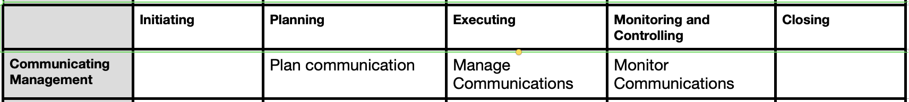

## Project Communications Mgmt
 - to ensure that the information needs of the project and its stakeholders are met

 - Project Communications Management consists of two parts.
 a) Developing a strategy to ensure communication is effective for stakeholders.
 b) Carrying out the activities necessary to implement the communication strategy.

 A project manager spends 90% of their time on communications

### 1. Plan Communications
  - process of developing an appropriate approach and plan for project communications activities based on the 1.information needs of each stakeholder
or group, 2.available organizational assets, and 3.the needs of the project
  
  - **Key benefit:** documented approach to effectively and efficiently engage stakeholders by presenting relevant information in a timely manner

**ITTO (Input, Tools & Techniques, Output)**
| Inputs                                      | Tools & Techniques                     | Outputs               |
|--------------------------------------------|----------------------------------------|-----------------------|
| 1. Project Charter                         | 1. Communication requirements analysis                   | 1. Communication plan  |
| 2. Project docs                            | 2. Communication Technology                      |  |
| 3. EEFs (Enterprise Environmental Factors) | 3. Communication methods               |                       |

#### Tools & Techniques:
**Communication requirements Analysis** 
  - Analysis of communication requirements determines the information needs of the project stakeholders
  - Number of channels = n(n-1)/2
**Communication Technology**
  - meetings, written documents, social media, and websites
**Communication Models**
  - communication cycle involves Encode Transmit Decode
**Communication Methods**
  - Interactive communication - Between two or more parties performing a multidirectional exchange of
information in real time.
  - Push - Sent directly to specific receipients Eg: blogs
  - Pull - Access content at their own discretion (Web)

#### Key Output:  
1. Communication Plan - See template [Communication Plan](../../templates/Communication_Plan_template.md)
 - Includes information to be communicated (language format content, escalation process etc)

### 2. Manage Communications
- process of ensuring timely and appropriate collection, creation, distribution, storage, retrieval, management, monitoring, and the ultimate disposition of
project information

- **Key Benefit:** enables an efficient and effective information flow between the project team and the stakeholders

**ITTO (Input, Tools & Techniques, Output)**
| Inputs                                      | Tools & Techniques                     | Outputs               |
|--------------------------------------------|----------------------------------------|-----------------------|
| 1. Project Charter                         | 1. Communication competence - feedback, nonverbal                   | 1. Project communications  |
| 2. Project Plan                            | 2. Networking                      |  |

#### Tools & Techniques:
1. Communication skills
  - feedback, non verbal

2. PMIS
  - Virtual support, email, conferencing

3. Interpersonal skills
  - Active listening, networking

#### Key Output:  
1. Project communications - Performance reports, deliverable status, schedule progress etc

### 3. Monitor communications
- process of ensuring the information needs of the project and its stakeholders are met
  
- **Key Benefit** optimal information flow as defined in the communications management plan and the stakeholder engagement plan

**ITTO (Input, Tools & Techniques, Output)**
| Inputs                                      | Tools & Techniques                     | Outputs               |
|--------------------------------------------|----------------------------------------|-----------------------|
| 1. Project Charter                         | 1. Interpersonal and team skills                   | 1. WPI, Change requests  |
| 2. Project Plan                            | 2. Ground rules                      |  |

#### Tools & Techniques:
1. Stakeholder engagement assessment - supports comparison between the current engagement levels of stakeholders(C) and the desired engagement levels(D) required for successful project delivery

2. Observation/conversation - Observation(Job shadowing)and conversation provide a direct way of viewing individuals in their environment and how they perform their
jobs or tasks and carry out processes

#### Key Output:  

1. WPI - includes information on how project communication is performing by comparing the communications that were implemented compared to those that were planned

2. Change Request - Revision of stakeholder communication requirements, including stakeholders’
information distribution, content or format, and distribution method
