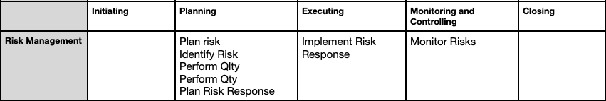

## Project Risk Mgmt
 - processes for incorporating the organization’s Quality policy(regarding planning, managing, and controlling project) and 
Product Quality requirements in order to meet stakeholders’ objectives

### 1. Plan Risk
  - process of 
    a) Identifying Quality requirements and/or standards for the project and its deliverables &
    b) Documenting how the project will demonstrate compliance with Quality requirements and/or standards
  
  - Key benefit: Provides guidance and direction on how the Quality will be managed and verified throughout the project

**ITTO (Input, Tools & Techniques, Output)**
| Inputs                                      | Tools & Techniques                     | Outputs               |
|--------------------------------------------|----------------------------------------|-----------------------|
| 1. Project Charter                         | 1. Expert judgement                   | 1. Quality management plan |
| 2. Project Plan                            | 2. Benchmarking                      | 2. Quality metrics |
| 3. EEFs (Enterprise Environmental Factors) | 3. Cost Benefit Analysis               |                       |
| 4. OPAs (Organizational Process Assets)    | 4. Test and inspection planning                            |                       |

#### Tools & Techniques:
**Matrix diagrams**
  - Helps to find the strength of relationships among different factors between the rows and columns that form the matrix
  - Test & inspection Planning - Determine how to test or inspect the product, deliverable, or service to meet the stakeholders’ needs and expectations

#### Key Output:  
1. Quality Management Plan 
  - The component of the project management plan that describes how applicable policies, procedures, and guidelines will be
implemented to achieve the quality objectives
