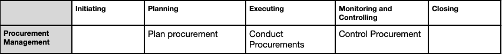

## Project Procurement Mgmt

- Project Procurement Management includes the processes necessary to purchase or acquire products, services, or results needed from outside the project team.
- includes the management and control processes required to develop and administer agreements
- Ex: Contracts, Purchase orders, SLAs

### Key Concepts:
- Procurement processes involve agreements that describe the relationship between two parties—a buyer and a seller
- contract document should be written in a manner that complies with local, national, and international laws
- contract should clearly state the deliverables and results expected, including any knowledge transfer from the seller to the buyer
- Anything not in the contract cannot be legally enforced.
- The project manager is typically not authorized to sign legal agreements binding the organization; this is reserved for those who have the authority to do so
- project management team’s responsibility to make certain that all procurements meet the specific needs of the project while working with the procurement office to ensure organizational procurement policies are followed
- Depending on the application area, an agreement can be a contract, SLA, MOA, or a purchase order

### Plan Procurement

The process of documenting project procurement decisions, specifying the approach and identifying potential sellers

Key Benefit- It determines whether to acquire goods and services from outside the project and, if so, what to acquire as well as how and when to acquire it.

**ITTO (Input, Tools & Techniques, Output)**
| Inputs                                      | Tools & Techniques                     | Outputs               |
|--------------------------------------------|----------------------------------------|------------------------|
| 1. Project charter                           | 1. Market research                    | 1. Procurement plan    |
| 2. business docs                              | 2. make or buy analysis              | 2. bid docs     |
| 3. project mgt plan                         | 3. source selection analysis           | 3. SOW     |
| 4. risk register                            |                             |                       |
| 5. requirements documentation                |                            |                       |

#### Activities involved:
- Prepare the procurement statement of work (SOW)
- Prepare high level cost estimate to determine the budget
- Advertise the opportunity 
- Prepare and issue bid docs
- Conduct technical evaluation of proposals 
- Perform cost evaluation of the proposals
- Finalize negotiations and sign contract between buyer and seller

#### Contract Types
**1. Fixed Price Contracts**
     - Involves setting a fixed total price for product, service or result to be provided.
    
   - Firm Fixed Price - Eg: Rental lease
	 - price for goods is set at the outset and not subject to change unless the scope of work changes
    
   - Fixed Price Incentive Fee 
	 - buyer and seller some flexibility in that it allows for deviation from performance, with financial incentives tied to achieving agreed-upon metrics

   - Fixed Price Economic Price Adjustment
	 - seller’s performance period spans a considerable period of years or payments are made in a different currency
	 - adjustments to the contract price due to inflation changes or cost increases/decreases for specific commodities

2. Fixed Price Contracts
    - involves payments (cost reimbursements) to the seller for all legitimate actual costs incurred for completed work, plus a fee for seller profit
	
    - Cost Plus Fixed Fee
	    - The seller is reimbursed for all allowable costs for performing the contract work and receives a fixed-fee payment calculated as a percentage of the initial estimated project costs
	- Cost Plus Incentive Fee
	    - seller is reimbursed for all allowable costs for performing the contract work and receives a predetermined incentive fee based on achieving certain performance objectives as per contract
	- Cost Plus Award Fee
	    - seller is reimbursed for all legitimate costs, but the majority of the fee is earned based on the satisfaction of certain broad subjective performance criteria

Preapproved Seller Lists
	Lists of sellers that have been properly vetted can streamline the steps needed to advertise the opportunity and shorten the timeline for the seller selection process

#### KeyTools & Techniques
**Source Selection Analysis**
	- Least cost - Use when procurement is standard or routine nature
	- Qualifications only - Select bidder with best credibility, qualifications 
	- Quality based - Technical first evaluated + Financial proposal negotiated and accepted 

#### Key Outputs
   - Procurement plan
	 - Activites to be undertaken during the procurement process.
		Timetable of procurement activities, metrics to be manage contracts, stakeholder roles and responsibilities, risk issues, 

   - Procurement Strategy
	 - Determine Project delivery 
	 - Type of binding agreements
	 - How procurement will advance through the phases

   - Delivery Methods
	 - Services with no subcontracting
	 - Joint venture between buyer and service provider

   - Contract Payment Types
	 - Fixed price

   - Procurement Phases
	 - Phasing of procurement
     - Criteria for moving to next phases
	 - Monitoring and evaluation plan for tracking progress
		
   -  Bid Documents
	 - Solicit proposals from prospective sellers
	 - RFI - More information on goods and services to be acquired is needed from the sellers
	 - RFQ - More information is needed on how vendors would satisfy the requirements and how much it will cost
	 - RFP - Used when problem in the project is clear and solution is not easy to determine

  - SOW
	- Describes the procurement item in detail that allows prospective sellers to determine if they are capable of providing services/prodcut or results.
	- SOW is called Terms of Reference that includes
		- Tasks of contractor
	    - Data that needs to be submitted for approval
   
  - Source Selection Criteria
    - Capability & capacity
	- Product cost	
	- Delivery dates
	- technical expertise
	- staff qualifications, availability and competence

### Conduct Procurement
  - process of obtaining seller responses, selecting a seller, and awarding a contract.

  - Key Benefit- It selects a qualified seller and implements the legal agreement for delivery.

**ITTO (Input, Tools & Techniques, Output)**
| Inputs                                      | Tools & Techniques                     | Outputs               |
|--------------------------------------------|----------------------------------------|------------------------|
| 1. Project doc                           | 1. Advertise                    | 1. Selected sellers    |
| 2. business docs                              | 2. data analysis              | 2. agreements     |
| 3. procurement docs                         | 3. proposal evaluation           |      |
| 4. seller proposals                         | 3. source selection analysis           |      |

#### Tools 
 - Advertising - Communication with potential users of product
 - Bidder conferences - Meetings between buyer and prospective sellers prior to proposal submittal
 - Proposal evaluation - Ensure they are complete respond in full to SOW
 - Negotiation - Led by member of procurement team that has authority to sign contracts

#### Output
   1. Selected seller - judged to be in a competitive range based on the outcome of the proposal or bid evaluation
   2. Agreements - contract is a mutually binding agreement that obligates the seller to provide the specified products, services, or results; obligates the buyer to compensate the seller

### Control Procurements
 - Process of managing procurement relationships, monitoring contract performance, and making changes and corrections as appropriate, and closing out contracts

 - Key Benefit- It ensures that both the seller’s and buyer’s performance meet the project’s requirements according to the terms of the legal agreement.

**ITTO (Input, Tools & Techniques, Output)**
| Inputs                                      | Tools & Techniques                     | Outputs               |
|--------------------------------------------|----------------------------------------|------------------------|
| 1. Project doc                           | 1. Claims Admin                    | 1. Closed Procurements    |
| 2. Approved change req                              | 2. Inspection              | 2. WPI     |
| 3. procurement docs                         | 3. Audit           |      |

- Both the buyer and the seller administer the procurement contract and ensure that both parties meet their contractual obligations and that their own legal rights are protected.

**Administrative activities may include:**
1. Collection of data and managing project records
2. Refinement of procurement plans and schedules
3. Gathering, analyzing, and reporting procurement-related project data.

#### Key Tools and Techniques
1. Claims Administration
    - If there is a disagreement between the buyer and seller regarding the changes applied are called as contested claims.
    - If the parties themselves do not resolve a claim, it may have to be handled in accordance with Alternative Dispute Resolution (ADR)

2. Inspection
    - An inspection is a structured review of the work being performed by the contractor. involves simple review of the deliverables or an actual physical review of the work itself.

3. Audits
    - Audits are a structured review of the procurement process

#### Outputs
 1. Closed Procurements
    - Buyer, usually through its authorized procurement administrator, provides the seller with formal written notice that the contract has been 
completed
	- There should be no outstanding claims or invoices, and all final payments should have been made

 2. Work Performance Information
    - Information on how a seller is performing by comparing the deliverables technical performance &costs incurred and accepted against the SOW budget
