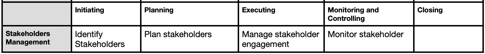

## Project Stakeholder Mgmt
 - processes required to identify the people, groups, or organizations that could impact or be impacted by the project

**Why identify stakeholders?** To analyze stakeholder expectation and thier impact on the project

To develop appropriate strategies for effectively engaging the stakeholders in project decisions and execution.
On continuous communication with all stakeholders, including team members, to understand their needs and expectations,
  - Address issues as they occur,
  - Manage conflicting interests, and
  - Foster appropriate stakeholder engagement in project decisions and activities

Every project has stakeholders who are impacted by or can impact the project in a positive or negative way

When: To increase the chances of success, the process of stakeholder identification
and engagement should commence as soon as possible after the project charter has been approved

## 1. Identify Stakeholder  
 - process of identifying project stakeholders regularly and analyzing and documenting relevant information regarding their interests, involvement, interdependencies, influence, and potential impact on project success.

**Key Benefit**: enables the project team to identify the appropriate focus for
engagement of each stakeholder or group of stakeholders.

**ITTO (Input, Tools & Techniques, Output)**

| Inputs                                      | Tools & Techniques                     | Outputs              |
|--------------------------------------------|----------------------------------------|-----------------------|
| 1. Project Charter                         | 1. Expert judgement                    | 1. Stakeholder Register      |
| 2. Project Plan                            | 2. Data gathering                      | 2. Change requests                      |
| 3. Project docs                            | 3. Data Analysis                            |                       |
| 4. Agreements                              | 4. Stakeholder Analysis matrix                     |

Stakeholder Mapping: Categorizing stakeholders assists the team in building relationships with the identified project stakeholders
**Stakeholder analysis:**
Their roles, position, expectation, attitudes, Interest on the project
Legal rights ,Ownership, Knowledge and contribution to the project

**Output:**
 - Stakeholder register contains information about identified stakeholders.
 - Identification information. Name, organizational position, location and contact details, and role on the project.
Assessment information.

 

## 2. Plan Stakeholder engagement
 - process of developing approaches to involve project stakeholders based on their needs, expectations, interests, and potential impact on the project
   
**Key Benefit**: actionable plan to interact effectively with stakeholders

**ITTO (Input, Tools & Techniques, Output)**

| Inputs                                      | Tools & Techniques                     | Outputs              |
|--------------------------------------------|----------------------------------------|-----------------------|
| 1. Project Charter                         | 1. Expert judgement                    | 1. Stakeholder Register      |
| 2. Project Plan                            | 2. Data gathering                      | 2. Change requests                      |
| 3. Project docs                            | 3. Data Analysis                            |                       |
| 4. Agreements                              | 4. Stakeholder engagement matrix                     |

Stakeholder Mapping: Categorizing stakeholders assists the team in building relationships with the identified project stakeholders

**Output:**
 - stakeholder engagement plan is a component of the project management plan that identifies the strategies and actions required to promote productive involvement of stakeholders in decision making and execution

Image: stakeholder Engagement Matrix

**Template:** [Stakeholder_engagement plan](../../templates/Stakeholder_engagement_template.docx)

 

## 3. Manage Stakeholder engagement
 - process of communicating and working with stakeholders to meet their
needs and expectations, address issues, and foster appropriate stakeholder involvement
   
**Key Benefit**: Allows project manager to increase support and minimize resistance from stakeholders.

**ITTO (Input, Tools & Techniques, Output)**

| Inputs                                      | Tools & Techniques                     | Outputs              |
|--------------------------------------------|----------------------------------------|-----------------------|
| 1. Project communication plan                         | 1. Expert judgement                    | 1. Change requests      |
| 2. Project Plan                            | 2. Communication skills                      |                |
| 3. Project docs                            | 3. Data Analysis                            |                       |
| 4. Agreements                              | 4. Ground rules                     |

- Engaging stakeholders at appropriate project stages to obtain, confirm, or
maintain their continued commitment to the success of the project

- Managing stakeholder expectations through negotiation and communication

**Ground Rules:** 
 - Defined in the team charter set the expected behavior for project team members, as well as other stakeholders, with regard to stakeholder engagement.

**Output:**
**Change Request:** As a result of managing stakeholder engagement, changes to the project
scope or product scope may emerge 

 

## 4. Monitor Stakeholder engagement
 - Process of monitoring project stakeholder relationships and tailoring strategies for engaging stakeholders through modification of engagement strategies and plans
   
**Key Benefit**: maintains or increases the efficiency and effectiveness of stakeholder engagement activities as the project evolves and its environment changes

**ITTO (Input, Tools & Techniques, Output)**

| Inputs                                      | Tools & Techniques                     | Outputs              |
|--------------------------------------------|----------------------------------------|-----------------------|
| 1. Project plan                         | 1. Decision Making                    | 1. Change requests      |
| 2. WPD                             | 2. Communication skills                      | 2. WPI               |
| 3. Project docs                            | 3. Data Analysis                            |                       |
|                               | 4. Stakeholder engagement matrix |

WPD: Contains data on project status such as which stakeholders are supportive of the project, and their level and type of engagement

**Output:**
 - **WPI:** Includes information about the status of stakeholder engagement, such as the level of current project support and compared to the desired levels of engagement as defined in the stakeholder engagement assessment
matrix, stakeholder cube, or other tool
 - **Change request** may include corrective and preventive actions to improve the current level of stakeholder engagement

