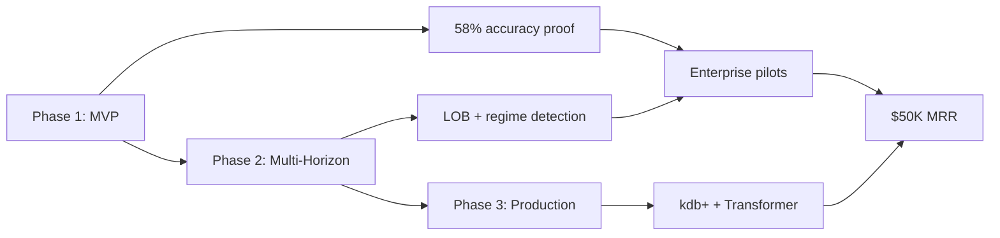

# 7. Roadmap

## 7.1 Timeline Overview

| Phase | Duration | Key Deliverables | Milestone |
|-------|----------|------------------|-----------|
| **Phase 1 (MVP)** | 3 months | LSTM forecast, Streamlit dashboard, Flask API | Demo-ready, 58% accuracy |
| **Phase 2** | 6 months | Multi-horizon, LOB, regime detection, VaR | 3 enterprise pilots |
| **Phase 3** | 12 months | Transformer ensemble, kdb+, options scanner, React | Production-ready, $50K MRR |

---

## 7.2 Phase 1: MVP (Months 1–3)

### Goal
Build a **demo-ready MVP** that proves LSTM achieves 58%+ directional accuracy vs. 48% random.

### Features (Must-have from MoSCoW)

| Week | Deliverables | Owner | Status |
|------|--------------|-------|--------|
| **Week 1–2** | Project setup, requirements.txt, directory structure | You | ✅ Done |
| **Week 3–4** | LSTM model definition, training pipeline | ML Engineer | 🟡 In Progress |
| **Week 5–6** | Flask API (`/api/predict`, `/api/data`, `/api/health`) | Backend Eng | ⚪ Not Started |
| **Week 7–8** | Streamlit dashboard (stock selector, forecast chart, vol chart) | Frontend Eng | ⚪ Not Started |
| **Week 9–10** | yfinance integration, data preprocessing | ML Engineer | ⚪ Not Started |
| **Week 11–12** | Backtesting, accuracy validation, bug fixes | You + ML Eng | ⚪ Not Started |
| **Week 13** | Demo script, PRD finalization, interview prep | You | ⚪ Not Started |

### Exit Criteria (Definition of Done)
- [ ] LSTM trained, loss <0.01 after 100 epochs
- [ ] Directional accuracy ≥55% (1hr horizon) on backtest
- [ ] All 3 API endpoints return 200 OK
- [ ] Dashboard loads in <3 seconds, no JavaScript errors
- [ ] 100 forecast calls successfully completed
- [ ] 10 user tests: 8/10 rate "useful" or "very useful"
- [ ] PRD complete (all 8 sections)
- [ ] Demo script rehearsed (5–6 min, <30 sec overrun)

### Resources
- **Team**: 1 ML engineer (part-time), 1 backend (part-time), you (PM)
- **Budget**: $50K (compute + data)
- **Compute**: Local GPU (free) or AWS p3.2xlarge ($3/hr × 100hr = $300)

---

## 7.3 Phase 2: Multi-Horizon + Regime Detection (Months 4–9)

### Goal
Add **6-horizon output** (1min–30day) and **regime detection** to improve accuracy to 60%+.

### Features (Should-have from MoSCoW)

| Month | Deliverables | Owner | Status |
|-------|--------------|-------|--------|
| **Month 4** | 6-horizon forecast (1min, 5min, 1hr, 1day, 5day, 30day) | ML Eng | ⚪ Not Started |
| **Month 5** | Limit order book (LOB) data integration | Data Eng | ⚪ Not Started |
| **Month 6** | Regime detection (high/low vol, auto model weight switching) | ML Eng | ⚪ Not Started |
| **Month 7** | Multi-asset dashboard (50+ stocks grid view) | Frontend Eng | ⚪ Not Started |
| **Month 8** | VaR calculation with forecasted vol, stress testing | ML Eng | ⚪ Not Started |
| **Month 9** | 3 enterprise pilots (LSEG, JPM, MS) signed | You (Sales) | ⚪ Not Started |

### Exit Criteria
- [ ] 6 horizons displayed side-by-side in dashboard
- [ ] LOB data integrated (Level 2/3 for 5 stocks)
- [ ] Regime detection 85% accurate (high vs. low vol classification)
- [ ] Multi-asset dashboard loads in <5 seconds for 50 stocks
- [ ] VaR calculation matches Bloomberg VaR within 5%
- [ ] 3 signed LOIs from enterprise pilots ($50K each)

### Resources
- **Team**: 2 ML engineers, 1 data engineer, 1 frontend, you (PM)
- **Budget**: $200K (team + kdb+ trial license)
- **Compute**: AWS p3.2xlarge (GPU) × 3 instances = $900/month

---

## 7.4 Phase 3: Production-Ready Enterprise Platform (Months 10–24)

### Goal
Build **production-grade platform** with Transformer ensemble, kdb+ database, options arbitrage scanner, React frontend.

### Features (Could-have + production infrastructure)

| Quarter | Deliverables | Owner | Status |
|---------|--------------|-------|--------|
| **Q4** | Transformer ensemble (Stockformer) for long-term horizons | ML Eng | ⚪ Not Started |
| **Q5** | kdb+ time-series database integration (replace yfinance) | Data Eng | ⚪ Not Started |
| **Q6** | Options implied vol arbitrage scanner (Bloomberg API) | ML Eng | ⚪ Not Started |
| **Q7** | React frontend (replace Streamlit), GPU auto-scaling (Kubernetes) | Frontend + DevOps | ⚪ Not Started |
| **Q8** | FIX protocol integration, enterprise SSO, audit trail | Backend + Security | ⚪ Not Started |

### Exit Criteria
- [ ] Transformer ensemble 5% more accurate than LSTM alone (long-term horizons)
- [ ] kdb+ integrated, 150K transactions/second processing [web:20]
- [ ] Options scanner detects mispricing 90% of time, <5% FP
- [ ] React frontend loads in <2 seconds (vs. 3s for Streamlit)
- [ ] FIX protocol certified by 1 exchange (Nasdaq or NYSE)
- [ ] $50K MRR (5 enterprise customers × $10K/month)

### Resources
- **Team**: 3 ML engineers, 2 data engineers, 2 frontend/backend, 1 DevOps, you (PM)
- **Budget**: $1.5M (team + kdb+ license $50K/year + Bloomberg API $25K/year)
- **Compute**: AWS p3.8xlarge × 5 instances = $4,500/month + Kubernetes overhead

---

## 7.5 Feature Release Schedule

| Feature | Phase 1 | Phase 2 | Phase 3 |
|---------|---------|---------|---------|
| LSTM volatility forecast | ✅ | ✅ (improved) | ✅ (ensemble) |
| 1/5/30-day horizons | ✅ | ✅ (6 horizons) | ✅ (6 horizons) |
| Flask API | ✅ | ✅ | ✅ (FIX added) |
| Streamlit dashboard | ✅ | ✅ | ❌ (React replaces) |
| 95% confidence intervals | ✅ | ✅ | ✅ |
| yfinance data | ✅ | ❌ (kdb+ replaces) | ❌ |
| Limit order book (LOB) | ❌ | ✅ | ✅ |
| Regime detection | ❌ | ✅ | ✅ |
| Multi-asset dashboard | ❌ | ✅ | ✅ |
| VaR with forecasted vol | ❌ | ✅ | ✅ |
| Options arbitrage scanner | ❌ | ❌ | ✅ |
| What-if simulator | ❌ | ❌ | ✅ |
| React frontend | ❌ | ❌ | ✅ |
| kdb+ database | ❌ | ❌ | ✅ |
| Transformer ensemble | ❌ | ❌ | ✅ |
| FIX protocol | ❌ | ❌ | ✅ |
| Enterprise SSO | ❌ | ❌ | ✅ |

---

## 7.6 Milestone Dependencies

**Critical Path**: MVP → Accuracy Proof → Enterprise Pilots → Revenue

---

## 7.7 Risk to Timeline

| Risk | Probability | Impact | Mitigation |
|------|-------------|--------|------------|
| **LSTM doesn't reach 58% accuracy** | 20% | High (MVP fails) | fallback to EWMA for MVP demo, continue tuning |
| **yfinance API rate limits** | 30% | Medium (dashboard slow) | Cache data locally, add retry logic |
| **ML engineer leaves mid-phase** | 10% | High | Document code thoroughly, pair programming |
| **kdb+ license delayed** | 15% | Medium (Phase 3 slips) | Use Refinitiv API as temporary backup |
| **Regulator rejects model** | 5% | Critical | Early engagement with EU/US regulators, third-party validation |
