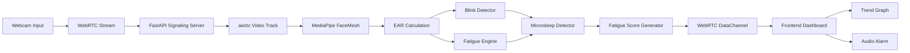

# 🚗 Driver Fatigue Detection System (Real-Time AI + WebRTC)

## Overview
A real-time AI system that detects driver fatigue using computer vision, blink detection, microsleep detection, and temporal fatigue modeling.

## 🎬 Live Demo

Experience the real-time driver fatigue monitoring pipeline in action:

- 👁️ MediaPipe facial landmark tracking
- 😴 Blink + microsleep detection
- 📊 Real-time fatigue trend visualization
- 🔊 Audio-based fatigue alerts
- 📡 Low-latency WebRTC streaming

👉 Watch demo: [Driver Fatigue System](https://drive.google.com/file/d/1f7WsQwBFYpVdbNWk4hAkC4JQVYeD0NEj/view?usp=drive_link)

## Architecture
- WebRTC-based video streaming
- MediaPipe FaceMesh for landmark detection
- EAR-based eye tracking
- Blink + microsleep detection
- Real-time fatigue scoring engine
- Live frontend dashboard with trend visualization

# Architecture



## Features
- Real-time face tracking
- Blink detection
- Microsleep detection
- Fatigue scoring (0–100)
- Audio alert system
- Trend graph visualization

## Tech Stack
- Python (FastAPI, aiortc)
- MediaPipe
- OpenCV
- JavaScript (WebRTC, Canvas)
- HTML/CSS

## System Flow
Camera → WebRTC → Backend AI → Fatigue Engine → UI Dashboard

## Key Highlights
- Low-latency (<300ms) inference pipeline
- Hybrid AI system (rules + vision)
- Temporal behavioral modeling
- Real-time streaming architecture

## Limitations
- Single-user session only
- No cloud scaling (MVP)
- Rule-based fatigue scoring

## Future Work
- Multi-driver fleet dashboard
- Cloud deployment (TURN servers)
- ML-based fatigue classifier
- Alert escalation system

## How to Run

Install requirements
```bash
pip install -r requirements.txt
```

How to run Backend
```
uvicorn backend.main:app --reload --port 8000
```

How to run Frontend
```
cd frontend
python3.11 -m http.server 5500
```
