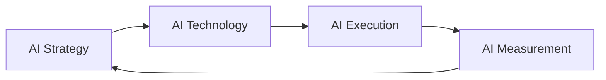

# AI Operating Model

A practical framework for planning, building, shipping, and improving AI-powered products and workflows.

---

# AI Lifecycle

```text
AI Strategy
    ↓
AI Technology
    ↓
AI Execution
    ↓
AI Measurement
    ↺
```

This creates a continuous AI improvement loop:
- define business goals
- build AI capabilities
- operationalize experiences
- measure outcomes
- optimize continuously

---

# AI Workflow Diagram



---

# 01 — AI Strategy

## Purpose

Defines why AI matters and what business outcomes it should drive.

This is the decision layer.

---

## Focus Areas

- customer problems
- business impact
- competitive advantage
- AI opportunities
- prioritization
- AI roadmap
- build vs buy decisions

---

## Typical Questions

- What problems should AI solve?
- Where does AI create leverage?
- What workflows should be automated?
- What is the ROI?
- What risks exist?

---

## Deliverables

```text
ai-vision.md
ai-roadmap.md
ai-use-cases.md
build-vs-buy-analysis.md
```

---

## Outputs

- prioritized AI initiatives
- business alignment
- capability roadmap
- investment decisions

---

# 02 — AI Technology

## Purpose

Defines how AI systems are architected, integrated, and maintained.

This is the capability layer.

---

## Focus Areas

- LLM selection
- RAG systems
- vector databases
- prompts
- agents
- orchestration
- AI infrastructure
- guardrails
- evaluation systems

---

## Typical Questions

- Which models should we use?
- How do we reduce hallucinations?
- What data powers the system?
- How do we scale reliably?
- How do we secure AI interactions?

---

## Deliverables

```text
model-evaluation.md
rag-architecture.md
prompt-library.md
agent-design.md
ai-stack.md
```

---

## Outputs

- scalable AI architecture
- reusable AI systems
- operational reliability
- technical foundation

---

# 03 — AI Execution

## Purpose

Turns AI systems into real product experiences and workflows.

This is the delivery layer.

---

## Focus Areas

- AI feature implementation
- UX integration
- rollout strategy
- experimentation
- human-in-the-loop workflows
- AI operations
- team coordination

---

## Typical Questions

- How should AI appear in the UX?
- What should be automated?
- What is MVP vs V2?
- Where should humans stay involved?
- How do we launch safely?

---

## Deliverables

```text
ai-prd.md
ai-user-flows.md
launch-plan.md
experiment-plan.md
human-in-loop-design.md
```

---

## Outputs

- shipped AI features
- operational AI workflows
- adoption enablement
- rollout execution

---

# 04 — AI Measurement

## Purpose

Measures whether AI systems create value and improve outcomes.

This is the learning and optimization layer.

---

## Focus Areas

- response quality
- business impact
- user adoption
- latency
- token cost
- hallucination tracking
- evaluations
- monitoring

---

## Typical Questions

- Is AI improving outcomes?
- Are responses accurate?
- What failures occur most often?
- Is adoption increasing?
- What should improve next?

---

## Deliverables

```text
ai-metrics-dashboard.md
evaluation-framework.md
hallucination-analysis.md
cost-monitoring.md
user-feedback-analysis.md
```

---

## Outputs

- measurable AI impact
- optimization insights
- quality improvements
- cost visibility

---

# Layer Summary

| Layer | Main Goal |
|---|---|
| AI Strategy | Decide what matters |
| AI Technology | Build capabilities |
| AI Execution | Deliver experiences |
| AI Measurement | Learn and optimize |

---

# Example

## AI Copilot Workflow

### AI Strategy
- reduce onboarding friction
- improve activation

### AI Technology
- GPT-based assistant
- RAG architecture
- vector search

### AI Execution
- embed assistant into onboarding
- support escalation fallback

### AI Measurement
- activation lift
- response quality
- CSAT
- token cost
- retention impact

---

# Recommended Folder Structure

```text
ai/
├── strategy/
├── technology/
├── execution/
├── measurement/
└── experiments/
```

---

# Recommended Ownership

| Area | Typical Owner |
|---|---|
| AI Strategy | PM / Leadership |
| AI Technology | AI Engineering |
| AI Execution | Product + Design + Engineering |
| AI Measurement | Analytics / AI Ops |

---

# Simplified Mental Model

```text
Strategy   = Why
Technology = How
Execution  = Ship
Measurement = Learn
```

---
