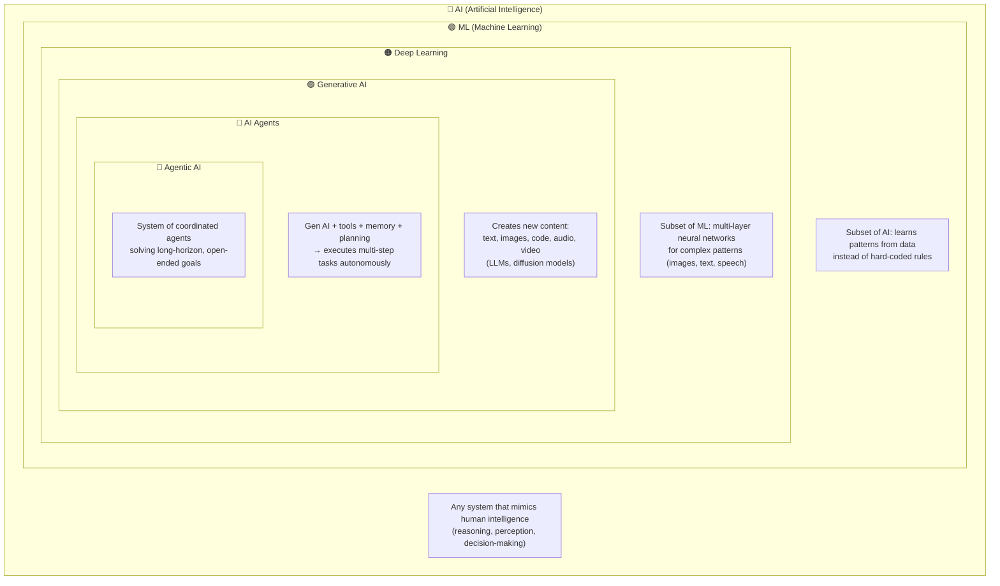

# AI Landscape for Executives & Product Leaders

*From Intelligence → Content Creation → Autonomous Action*

---

## Visual Hierarchy



---

## What Each Layer Encompasses

| Layer | Simple Definition | Key Components & Concepts |
|-------|------------------|---------------------------|
| **AI** | Making machines do tasks that need human intelligence | NLP, computer vision, robotics, expert systems, planning, reinforcement learning, game-playing, rule-based systems |
| **ML** | AI that learns patterns from data (not hard-coded rules) | Supervised learning, unsupervised learning, reinforcement learning, recommendation systems, trees, SVMs, regression |
| **Deep Learning** | ML using multi-layer neural networks for complex data | CNNs, RNNs/LSTMs, transformers, **attention**, **transfer learning**, speech recognition, advanced NLP, vision models |
| **Generative AI** | AI that creates new content from scratch | LLMs, diffusion models, transformers, **prompt engineering**, **RAG**, foundation models, text-to-image/audio/video |
| **AI Agents** | Gen AI that plans, uses tools, and acts autonomously | Tool-calling (APIs, DBs, browsers), planning loops, memory, feedback loops, task decomposition, AutoGPT, code assistants |
| **Agentic AI** | Coordinated agents solving long-horizon goals | Multi-agent systems, role-specialized agents (planner/executor/critic), shared memory, swarms, CrewAI, LangGraph |

---

## Strategic Implications for C-Level & Product Leaders

### For C-Level (Strategy & Investment)

| Dimension | Gen AI | AI Agents | Agentic AI |
|-----------|--------|-----------|------------|
| Capability | Reactive content creation | Proactive task execution | Multi-agent orchestration |
| Time Horizon | Now (deployed) | Next 12–18 months | Emerging (2–3 years) |
| Business Impact | Efficiency, content scale | Automation, workflow completion | Complex problem solving, emergent behavior |
| Examples | ChatGPT, Claude, Gemini | AutoGPT, CrewAI, LangGraph | Research assistants, ICU copilots, supply chain optimization |

### For Product Leaders (Roadmap & Use Cases)

**Gen AI (Now)**
- Use cases: Q&A chatbots, content generation, summarization, code assistants, translation
- Key tech: LLMs, prompt engineering, RAG, fine-tuning

**AI Agents (Next 12–18mo)**
- Use cases: Booking/travel planning, debugging, research automation, customer support workflows, data analysis
- Key tech: Tool-use enabled models, memory-augmented systems (RAG), planning loops

**Agentic AI (Emerging)**
- Use cases: Multi-team coordination, R&D discovery, supply chain optimization, enterprise orchestration
- Key tech: Multi-agent frameworks (CrewAI, LangGraph), shared memory, specialized role agents

---

## Key Distinction (Bottom Line)

> **Gen AI *responds* to prompts** → creates content  
> **AI Agents *execute* tasks** → take actions with tools  
> **Agentic AI *orchestrates* systems** → multi-agent coordination for complex goals

---

## Hierarchy Chain (Memorize This)
```
AI → ML → Deep Learning → Generative AI → AI Agents → Agentic AI
```
- Each layer builds on the previous one. You can't skip the foundation.
